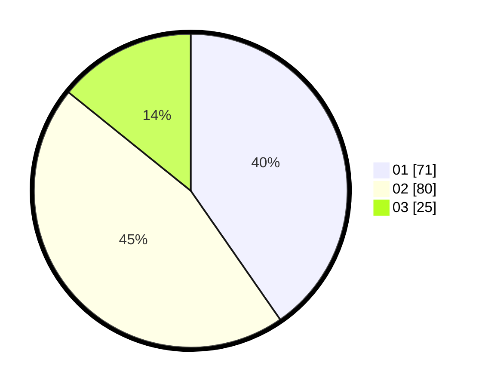

# Hasil

Hasil perolehan suara paslon dapat dilihat pada file paslon-01.txt, paslon-02.txt, dan paslon-03.txt.

Jika tidak ada, artinya data tersebut belum ada pada SIREKAP.

## Perolehan Suara

 * Paslon 01: **71**.
 * Paslon 02: **80**.
 * Paslon 03: **25**.

## Foto C Plano

https://sirekap-obj-formc.kpu.go.id/345e/pemilu/ppwp/31/74/01/10/05/3174011005110-20240214-212159--2b84ab43-d435-4c20-aa75-aa3275b2b06e.jpg

https://sirekap-obj-formc.kpu.go.id/345e/pemilu/ppwp/31/74/01/10/05/3174011005110-20240214-212226--f9aa0a38-8544-4978-a196-f101b521970f.jpg

https://sirekap-obj-formc.kpu.go.id/345e/pemilu/ppwp/31/74/01/10/05/3174011005110-20240214-212426--7f74c94b-08e1-4af1-a661-81bf13c070be.jpg

## DATA PEMILIH TETAP

Jumlah pemilih dalam DPT: **237**.
 * L: **124**.
 * P: **113**.

## DATA PENGGUNA HAK PILIH

Jumlah pengguna hak pilih dalam DPT: **174**.
 * L: **90**.
 * P: **84**.

Jumlah pengguna hak pilih dalam DPTb: **4**.
 * L: **3**.
 * P: **1**.

Jumlah pengguna hak pilih dalam DPK: **3**.
 * L: **2**.
 * P: **1**.

Jumlah pengguna hak pilih: **181**.
 * L: **95**.
 * P: **86**.

## JUMLAH SUARA SAH DAN TIDAK SAH

JUMLAH SELURUH SUARA SAH: **176**.

JUMLAH SUARA TIDAK SAH: **5**.

JUMLAH SELURUH SUARA SAH DAN SUARA TIDAK SAH: **181**.
