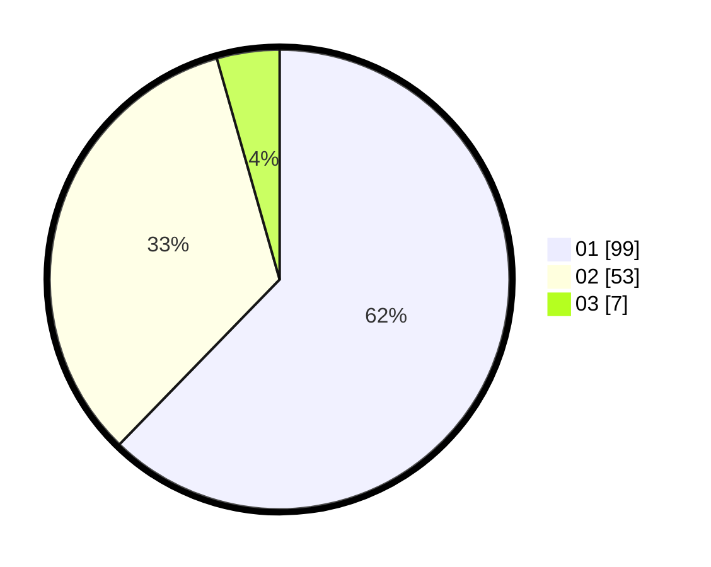

# Hasil

Hasil perolehan suara paslon dapat dilihat pada file paslon-01.txt, paslon-02.txt, dan paslon-03.txt.

Jika tidak ada, artinya data tersebut belum ada pada SIREKAP.

## Perolehan Suara

 * Paslon 01: **99**.
 * Paslon 02: **53**.
 * Paslon 03: **7**.

## Foto C Plano

https://sirekap-obj-formc.kpu.go.id/d803/pemilu/ppwp/31/74/01/10/05/3174011005111-20240214-141023--d4bc98cb-9c58-4d49-af2c-c2e84f762855.jpg

https://sirekap-obj-formc.kpu.go.id/d803/pemilu/ppwp/31/74/01/10/05/3174011005111-20240214-141514--0f928e57-261d-4e8b-9f67-fc38482fb5c9.jpg

https://sirekap-obj-formc.kpu.go.id/d803/pemilu/ppwp/31/74/01/10/05/3174011005111-20240215-122046--e7e39119-cdd6-40cb-a62c-a5dd6cfb8139.jpg

## DATA PEMILIH TETAP

Jumlah pemilih dalam DPT: **208**.
 * L: **108**.
 * P: **100**.

## DATA PENGGUNA HAK PILIH

Jumlah pengguna hak pilih dalam DPT: **163**.
 * L: **86**.
 * P: **77**.

Jumlah pengguna hak pilih dalam DPTb: **0**.
 * L: **0**.
 * P: **0**.

Jumlah pengguna hak pilih dalam DPK: **2**.
 * L: **2**.
 * P: **0**.

Jumlah pengguna hak pilih: **165**.
 * L: **88**.
 * P: **77**.

## JUMLAH SUARA SAH DAN TIDAK SAH

JUMLAH SELURUH SUARA SAH: **159**.

JUMLAH SUARA TIDAK SAH: **6**.

JUMLAH SELURUH SUARA SAH DAN SUARA TIDAK SAH: **165**.
