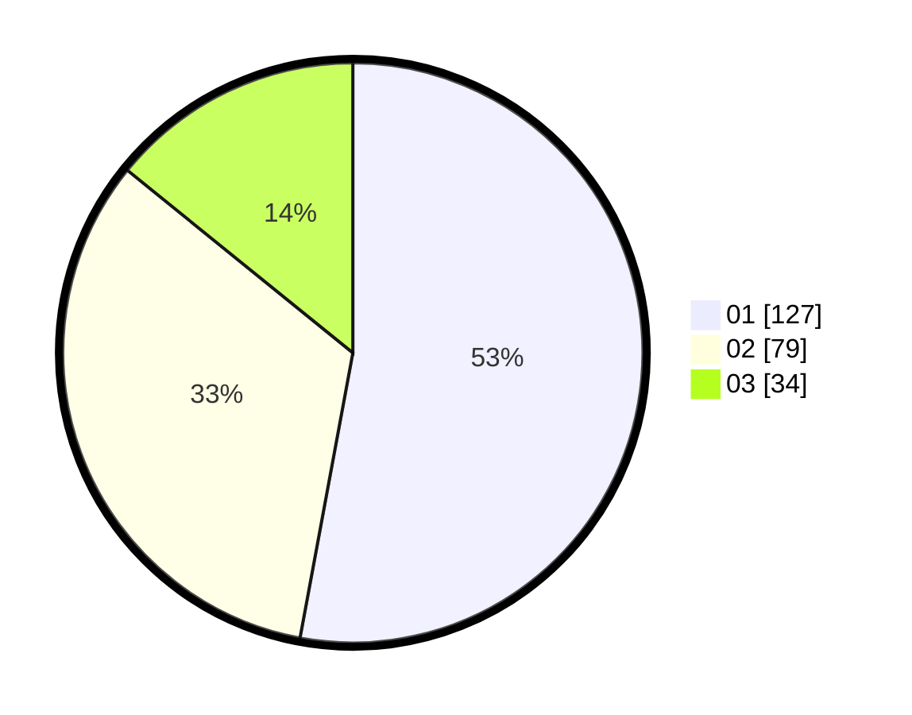

# Hasil

Hasil perolehan suara paslon dapat dilihat pada file paslon-01.txt, paslon-02.txt, dan paslon-03.txt.

Jika tidak ada, artinya data tersebut belum ada pada SIREKAP.

## Perolehan Suara

 * Paslon 01: **127**.
 * Paslon 02: **79**.
 * Paslon 03: **34**.

## Foto C Plano

https://sirekap-obj-formc.kpu.go.id/f15b/pemilu/ppwp/31/74/01/10/06/3174011006013-20240216-031213--f2c8bc79-0296-468b-aaf3-fe89b9d51873.jpg

https://sirekap-obj-formc.kpu.go.id/f15b/pemilu/ppwp/31/74/01/10/06/3174011006013-20240216-030630--709b4f90-4539-4141-b9de-48f6fd4793c7.jpg

https://sirekap-obj-formc.kpu.go.id/f15b/pemilu/ppwp/31/74/01/10/06/3174011006013-20240216-030629--3ecdb8ff-e52b-4a14-92bc-144a5da1acbb.jpg

## DATA PEMILIH TETAP

Jumlah pemilih dalam DPT: **272**.
 * L: **129**.
 * P: **143**.

## DATA PENGGUNA HAK PILIH

Jumlah pengguna hak pilih dalam DPT: **241**.
 * L: **110**.
 * P: **131**.

Jumlah pengguna hak pilih dalam DPTb: **0**.
 * L: **0**.
 * P: **0**.

Jumlah pengguna hak pilih dalam DPK: **0**.
 * L: **0**.
 * P: **0**.

Jumlah pengguna hak pilih: **244**.
 * L: **110**.
 * P: **134**.

## JUMLAH SUARA SAH DAN TIDAK SAH

JUMLAH SELURUH SUARA SAH: **240**.

JUMLAH SUARA TIDAK SAH: **4**.

JUMLAH SELURUH SUARA SAH DAN SUARA TIDAK SAH: **244**.
