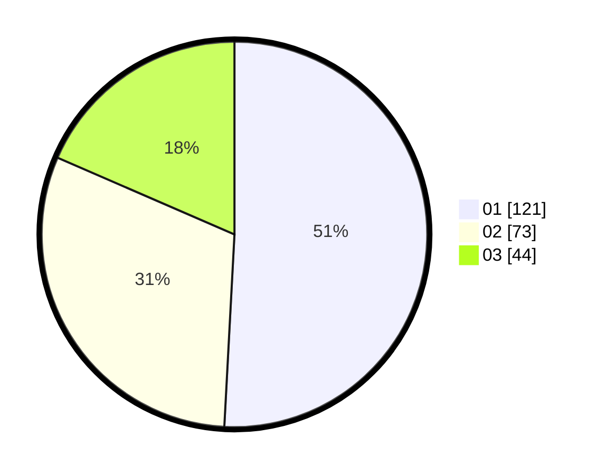

# Hasil

Hasil perolehan suara paslon dapat dilihat pada file paslon-01.txt, paslon-02.txt, dan paslon-03.txt.

Jika tidak ada, artinya data tersebut belum ada pada SIREKAP.

## Perolehan Suara

 * Paslon 01: **121**.
 * Paslon 02: **73**.
 * Paslon 03: **44**.

## Foto C Plano

https://sirekap-obj-formc.kpu.go.id/561a/pemilu/ppwp/31/74/01/10/06/3174011006014-20240217-011824--38000ffd-4a19-4387-b137-3209d62cf9b8.jpg

https://sirekap-obj-formc.kpu.go.id/561a/pemilu/ppwp/31/74/01/10/06/3174011006014-20240216-110113--d8001f4c-f920-4c22-8e8b-b2137c60ddea.jpg

https://sirekap-obj-formc.kpu.go.id/561a/pemilu/ppwp/31/74/01/10/06/3174011006014-20240216-110441--36a8e5f6-c50d-4bf3-95f3-90ec53fe9b8b.jpg

## DATA PEMILIH TETAP

Jumlah pemilih dalam DPT: **270**.
 * L: **131**.
 * P: **139**.

## DATA PENGGUNA HAK PILIH

Jumlah pengguna hak pilih dalam DPT: **229**.
 * L: **112**.
 * P: **117**.

Jumlah pengguna hak pilih dalam DPTb: **8**.
 * L: **2**.
 * P: **6**.

Jumlah pengguna hak pilih dalam DPK: **4**.
 * L: **2**.
 * P: **2**.

Jumlah pengguna hak pilih: **241**.
 * L: **116**.
 * P: **125**.

## JUMLAH SUARA SAH DAN TIDAK SAH

JUMLAH SELURUH SUARA SAH: **238**.

JUMLAH SUARA TIDAK SAH: **3**.

JUMLAH SELURUH SUARA SAH DAN SUARA TIDAK SAH: **241**.
