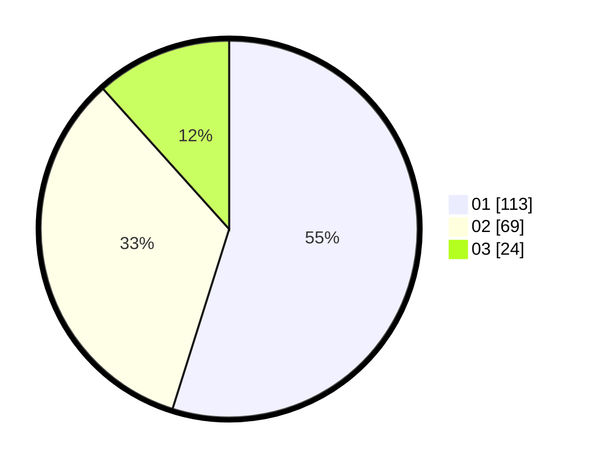

# Hasil

Hasil perolehan suara paslon dapat dilihat pada file paslon-01.txt, paslon-02.txt, dan paslon-03.txt.

Jika tidak ada, artinya data tersebut belum ada pada SIREKAP.

## Perolehan Suara

 * Paslon 01: **113**.
 * Paslon 02: **69**.
 * Paslon 03: **24**.

## Foto C Plano

https://sirekap-obj-formc.kpu.go.id/1d95/pemilu/ppwp/31/74/01/10/06/3174011006016-20240216-141425--09c4ed00-6e4a-426a-a350-024e1a1fcd3b.jpg

https://sirekap-obj-formc.kpu.go.id/1d95/pemilu/ppwp/31/74/01/10/06/3174011006016-20240216-141426--5de8e506-d800-4a5f-b6cd-20ec2dd31212.jpg

https://sirekap-obj-formc.kpu.go.id/1d95/pemilu/ppwp/31/74/01/10/06/3174011006016-20240216-141426--848fda0c-cce7-4505-b95e-19af978ff842.jpg

## DATA PEMILIH TETAP

Jumlah pemilih dalam DPT: **273**.
 * L: **138**.
 * P: **135**.

## DATA PENGGUNA HAK PILIH

Jumlah pengguna hak pilih dalam DPT: **203**.
 * L: **106**.
 * P: **97**.

Jumlah pengguna hak pilih dalam DPTb: **5**.
 * L: **3**.
 * P: **2**.

Jumlah pengguna hak pilih dalam DPK: **0**.
 * L: **0**.
 * P: **0**.

Jumlah pengguna hak pilih: **208**.
 * L: **109**.
 * P: **99**.

## JUMLAH SUARA SAH DAN TIDAK SAH

JUMLAH SELURUH SUARA SAH: **206**.

JUMLAH SUARA TIDAK SAH: **2**.

JUMLAH SELURUH SUARA SAH DAN SUARA TIDAK SAH: **208**.
