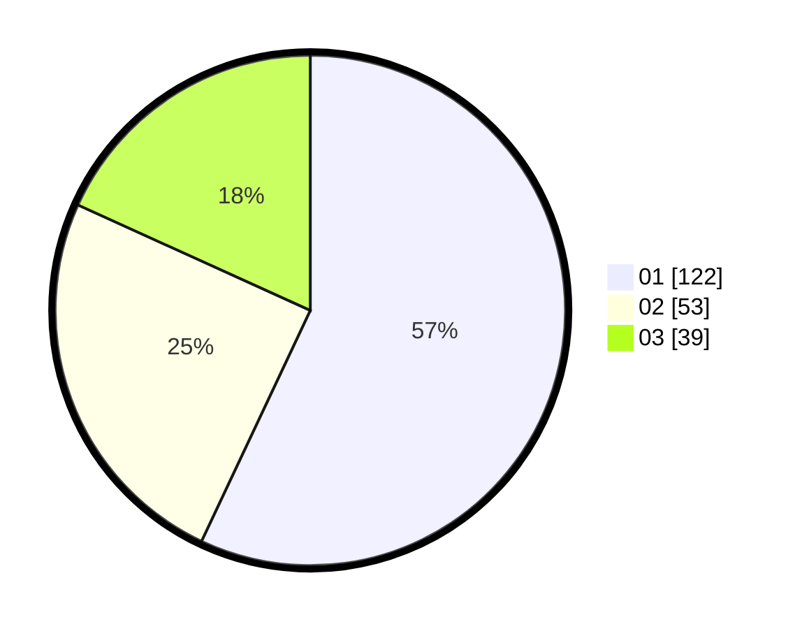

# Hasil

Hasil perolehan suara paslon dapat dilihat pada file paslon-01.txt, paslon-02.txt, dan paslon-03.txt.

Jika tidak ada, artinya data tersebut belum ada pada SIREKAP.

## Perolehan Suara

 * Paslon 01: **122**.
 * Paslon 02: **53**.
 * Paslon 03: **39**.

## Foto C Plano

https://sirekap-obj-formc.kpu.go.id/79ed/pemilu/ppwp/31/74/01/10/06/3174011006020-20240215-163158--b2aad947-d244-43ae-b096-80cd9529a0ec.jpg

https://sirekap-obj-formc.kpu.go.id/79ed/pemilu/ppwp/31/74/01/10/06/3174011006020-20240215-163243--c355bc6d-d5b2-4149-9d02-39d0630875e3.jpg

https://sirekap-obj-formc.kpu.go.id/79ed/pemilu/ppwp/31/74/01/10/06/3174011006020-20240215-163258--c78546b7-19dc-4ae6-a048-cc1bffd91b89.jpg

## DATA PEMILIH TETAP

Jumlah pemilih dalam DPT: **271**.
 * L: **142**.
 * P: **129**.

## DATA PENGGUNA HAK PILIH

Jumlah pengguna hak pilih dalam DPT: **207**.
 * L: **104**.
 * P: **103**.

Jumlah pengguna hak pilih dalam DPTb: **4**.
 * L: **1**.
 * P: **3**.

Jumlah pengguna hak pilih dalam DPK: **3**.
 * L: **2**.
 * P: **1**.

Jumlah pengguna hak pilih: **214**.
 * L: **107**.
 * P: **107**.

## JUMLAH SUARA SAH DAN TIDAK SAH

JUMLAH SELURUH SUARA SAH: **214**.

JUMLAH SUARA TIDAK SAH: **0**.

JUMLAH SELURUH SUARA SAH DAN SUARA TIDAK SAH: **214**.
