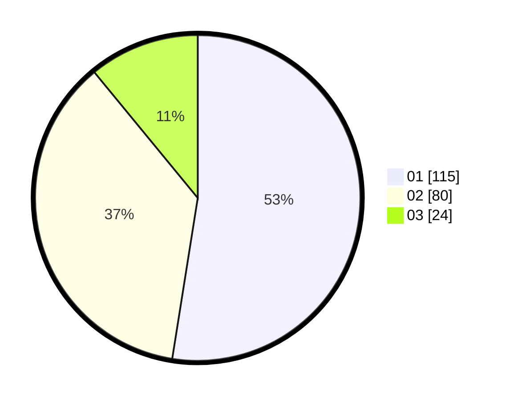

# Hasil

Hasil perolehan suara paslon dapat dilihat pada file paslon-01.txt, paslon-02.txt, dan paslon-03.txt.

Jika tidak ada, artinya data tersebut belum ada pada SIREKAP.

## Perolehan Suara

 * Paslon 01: **115**.
 * Paslon 02: **80**.
 * Paslon 03: **24**.

## Foto C Plano

https://sirekap-obj-formc.kpu.go.id/7565/pemilu/ppwp/31/74/01/10/06/3174011006021-20240215-180945--00bc87fa-33ac-405e-9ee8-2288d53c21bc.jpg

https://sirekap-obj-formc.kpu.go.id/7565/pemilu/ppwp/31/74/01/10/06/3174011006021-20240214-185854--8d851942-0725-41d0-8171-e0125d1bf567.jpg

https://sirekap-obj-formc.kpu.go.id/7565/pemilu/ppwp/31/74/01/10/06/3174011006021-20240214-194543--b295fefa-a426-4127-8729-217db570f991.jpg
