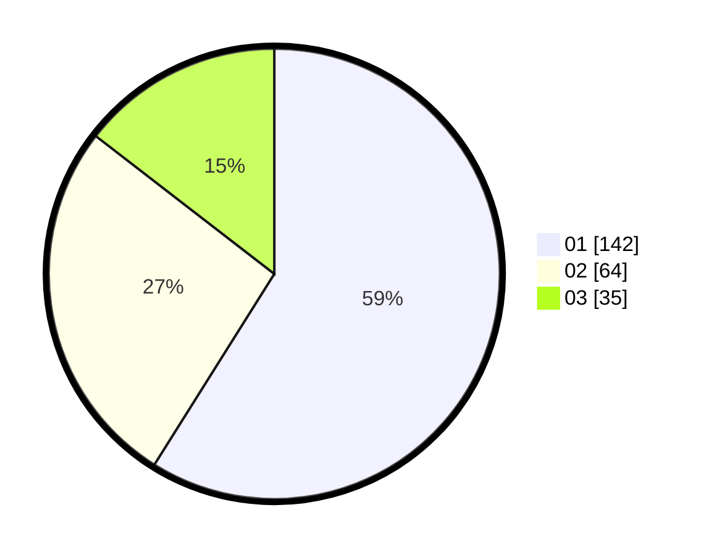

# Hasil

Hasil perolehan suara paslon dapat dilihat pada file paslon-01.txt, paslon-02.txt, dan paslon-03.txt.

Jika tidak ada, artinya data tersebut belum ada pada SIREKAP.

## Perolehan Suara

 * Paslon 01: **142**.
 * Paslon 02: **64**.
 * Paslon 03: **35**.

## Foto C Plano

https://sirekap-obj-formc.kpu.go.id/2256/pemilu/ppwp/31/74/01/10/06/3174011006024-20240215-211148--bf154fbb-b0c8-4156-a8ee-59c69be7180c.jpg

https://sirekap-obj-formc.kpu.go.id/2256/pemilu/ppwp/31/74/01/10/06/3174011006024-20240215-211150--9278b3c7-7629-4e2f-ac6e-c284ddd34dc3.jpg

https://sirekap-obj-formc.kpu.go.id/2256/pemilu/ppwp/31/74/01/10/06/3174011006024-20240215-211149--ddcc2b27-d5f3-43bd-be26-7520e30a6143.jpg

## DATA PEMILIH TETAP

Jumlah pemilih dalam DPT: **279**.
 * L: **134**.
 * P: **145**.

## DATA PENGGUNA HAK PILIH

Jumlah pengguna hak pilih dalam DPT: **238**.
 * L: **112**.
 * P: **126**.

Jumlah pengguna hak pilih dalam DPTb: **10**.
 * L: **4**.
 * P: **6**.

Jumlah pengguna hak pilih dalam DPK: **2**.
 * L: **0**.
 * P: **2**.

Jumlah pengguna hak pilih: **250**.
 * L: **116**.
 * P: **134**.

## JUMLAH SUARA SAH DAN TIDAK SAH

JUMLAH SELURUH SUARA SAH: **241**.

JUMLAH SUARA TIDAK SAH: **9**.

JUMLAH SELURUH SUARA SAH DAN SUARA TIDAK SAH: **250**.
