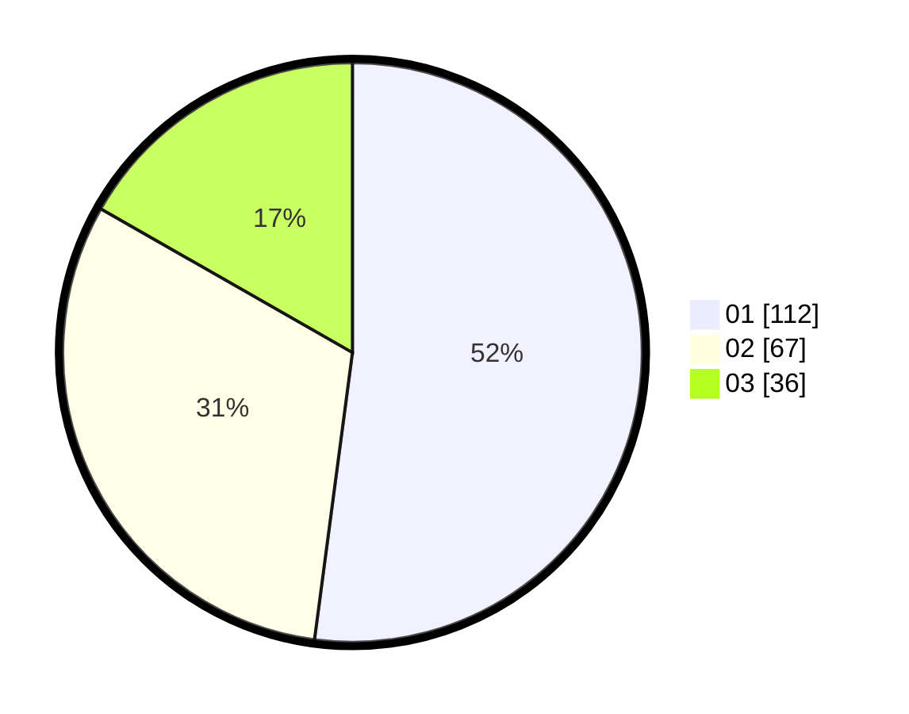

# Hasil

Hasil perolehan suara paslon dapat dilihat pada file paslon-01.txt, paslon-02.txt, dan paslon-03.txt.

Jika tidak ada, artinya data tersebut belum ada pada SIREKAP.

## Perolehan Suara

 * Paslon 01: **112**.
 * Paslon 02: **67**.
 * Paslon 03: **36**.

## Foto C Plano

https://sirekap-obj-formc.kpu.go.id/33dd/pemilu/ppwp/31/74/01/10/06/3174011006029-20240214-195007--2bf3b44c-069e-4a6f-af72-fb79fc474a51.jpg

https://sirekap-obj-formc.kpu.go.id/33dd/pemilu/ppwp/31/74/01/10/06/3174011006029-20240214-195016--cabc1283-ca22-4f19-8e21-679188538719.jpg

https://sirekap-obj-formc.kpu.go.id/33dd/pemilu/ppwp/31/74/01/10/06/3174011006029-20240214-195016--70994b37-fc37-4a9c-9883-50430617bcff.jpg

## DATA PEMILIH TETAP

Jumlah pemilih dalam DPT: **279**.
 * L: **148**.
 * P: **131**.

## DATA PENGGUNA HAK PILIH

Jumlah pengguna hak pilih dalam DPT: **213**.
 * L: **96**.
 * P: **117**.

Jumlah pengguna hak pilih dalam DPTb: **5**.
 * L: **0**.
 * P: **5**.

Jumlah pengguna hak pilih dalam DPK: **1**.
 * L: **0**.
 * P: **1**.

Jumlah pengguna hak pilih: **219**.
 * L: **96**.
 * P: **123**.

## JUMLAH SUARA SAH DAN TIDAK SAH

JUMLAH SELURUH SUARA SAH: **215**.

JUMLAH SUARA TIDAK SAH: **4**.

JUMLAH SELURUH SUARA SAH DAN SUARA TIDAK SAH: **219**.
