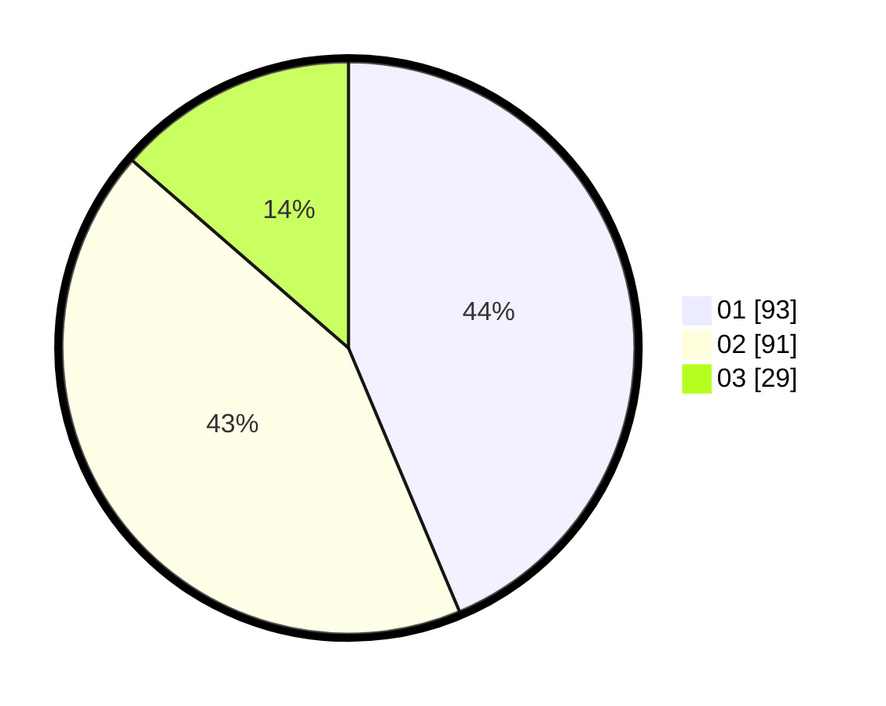

# Hasil

Hasil perolehan suara paslon dapat dilihat pada file paslon-01.txt, paslon-02.txt, dan paslon-03.txt.

Jika tidak ada, artinya data tersebut belum ada pada SIREKAP.

## Perolehan Suara

 * Paslon 01: **93**.
 * Paslon 02: **91**.
 * Paslon 03: **29**.

## Foto C Plano

https://sirekap-obj-formc.kpu.go.id/caf5/pemilu/ppwp/31/74/01/10/06/3174011006032-20240214-200837--08a5389b-2a60-4c0b-9f5c-3a09fc013e56.jpg

https://sirekap-obj-formc.kpu.go.id/caf5/pemilu/ppwp/31/74/01/10/06/3174011006032-20240214-200853--674a2d04-0bd5-4c57-8e6c-79ce6eb77173.jpg

https://sirekap-obj-formc.kpu.go.id/caf5/pemilu/ppwp/31/74/01/10/06/3174011006032-20240214-200909--2292fe51-d874-4f40-9a0f-afe47965ef5b.jpg

## DATA PEMILIH TETAP

Jumlah pemilih dalam DPT: **354**.
 * L: **125**.
 * P: **124**.

## DATA PENGGUNA HAK PILIH

Jumlah pengguna hak pilih dalam DPT: **214**.
 * L: **100**.
 * P: **114**.

Jumlah pengguna hak pilih dalam DPTb: **0**.
 * L: **0**.
 * P: **0**.

Jumlah pengguna hak pilih dalam DPK: **0**.
 * L: **0**.
 * P: **0**.

Jumlah pengguna hak pilih: **214**.
 * L: **100**.
 * P: **114**.

## JUMLAH SUARA SAH DAN TIDAK SAH

JUMLAH SELURUH SUARA SAH: **213**.

JUMLAH SUARA TIDAK SAH: **1**.

JUMLAH SELURUH SUARA SAH DAN SUARA TIDAK SAH: **214**.
