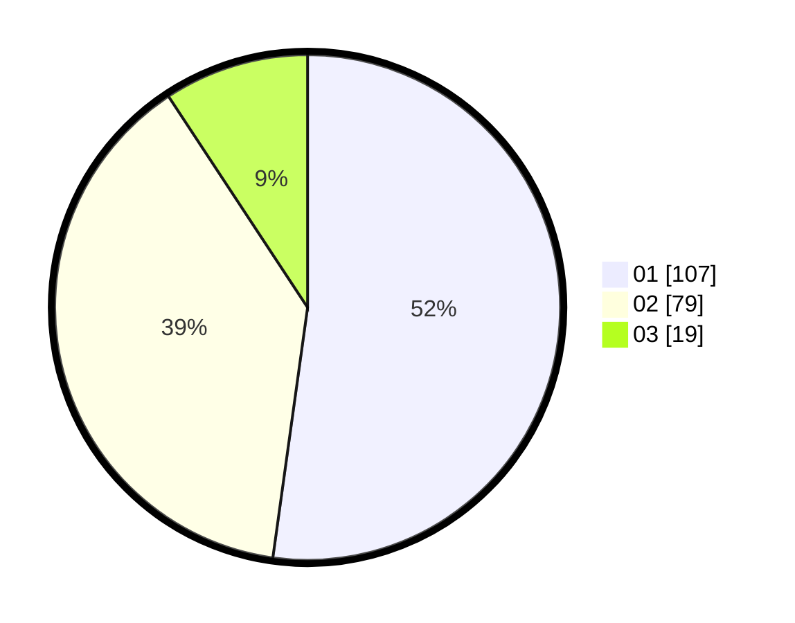

# Hasil

Hasil perolehan suara paslon dapat dilihat pada file paslon-01.txt, paslon-02.txt, dan paslon-03.txt.

Jika tidak ada, artinya data tersebut belum ada pada SIREKAP.

## Perolehan Suara

 * Paslon 01: **107**.
 * Paslon 02: **79**.
 * Paslon 03: **19**.

## Foto C Plano

https://sirekap-obj-formc.kpu.go.id/593c/pemilu/ppwp/31/74/01/10/06/3174011006042-20240215-033052--91c1ec6d-bae2-478c-90cb-c0fc0e55709b.jpg

https://sirekap-obj-formc.kpu.go.id/593c/pemilu/ppwp/31/74/01/10/06/3174011006042-20240215-032103--54473220-bbb8-4955-86cc-552a3b961364.jpg

https://sirekap-obj-formc.kpu.go.id/593c/pemilu/ppwp/31/74/01/10/06/3174011006042-20240215-033142--ea28d0d6-e5b3-45eb-b87a-ab29fa041547.jpg
