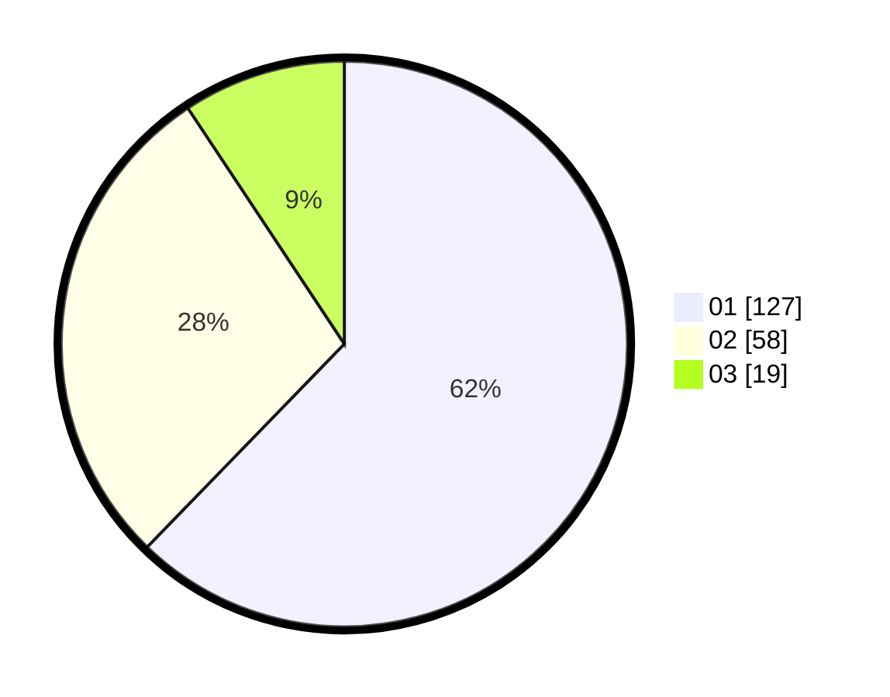

# Hasil

Hasil perolehan suara paslon dapat dilihat pada file paslon-01.txt, paslon-02.txt, dan paslon-03.txt.

Jika tidak ada, artinya data tersebut belum ada pada SIREKAP.

## Perolehan Suara

 * Paslon 01: **127**.
 * Paslon 02: **58**.
 * Paslon 03: **19**.

## Foto C Plano

https://sirekap-obj-formc.kpu.go.id/a6a1/pemilu/ppwp/31/74/01/10/06/3174011006044-20240214-155145--6fbb0a91-3cd2-4d07-b9ac-926037f3d8f3.jpg

https://sirekap-obj-formc.kpu.go.id/a6a1/pemilu/ppwp/31/74/01/10/06/3174011006044-20240214-155234--3ff7dabd-f304-4091-b62c-5efef55302a5.jpg

https://sirekap-obj-formc.kpu.go.id/a6a1/pemilu/ppwp/31/74/01/10/06/3174011006044-20240214-155525--e78fda41-b2c7-495e-b82f-56bcd7690b3b.jpg

## DATA PEMILIH TETAP

Jumlah pemilih dalam DPT: **238**.
 * L: **117**.
 * P: **121**.

## DATA PENGGUNA HAK PILIH

Jumlah pengguna hak pilih dalam DPT: **208**.
 * L: **100**.
 * P: **108**.

Jumlah pengguna hak pilih dalam DPTb: **2**.
 * L: **1**.
 * P: **1**.

Jumlah pengguna hak pilih dalam DPK: **0**.
 * L: **0**.
 * P: **0**.

Jumlah pengguna hak pilih: **210**.
 * L: **101**.
 * P: **109**.

## JUMLAH SUARA SAH DAN TIDAK SAH

JUMLAH SELURUH SUARA SAH: **204**.

JUMLAH SUARA TIDAK SAH: **6**.

JUMLAH SELURUH SUARA SAH DAN SUARA TIDAK SAH: **210**.
