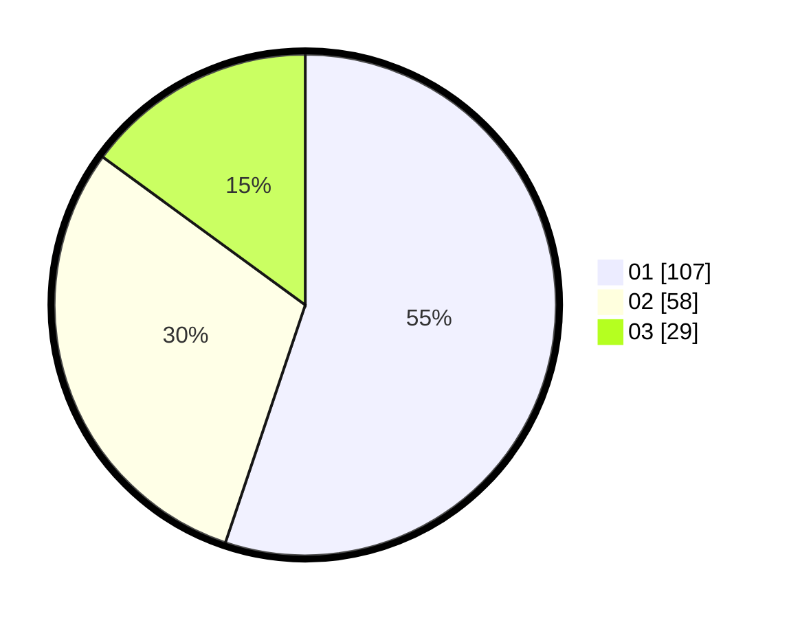

# Hasil

Hasil perolehan suara paslon dapat dilihat pada file paslon-01.txt, paslon-02.txt, dan paslon-03.txt.

Jika tidak ada, artinya data tersebut belum ada pada SIREKAP.

## Perolehan Suara

 * Paslon 01: **107**.
 * Paslon 02: **58**.
 * Paslon 03: **29**.

## Foto C Plano

https://sirekap-obj-formc.kpu.go.id/60ae/pemilu/ppwp/31/74/01/10/06/3174011006045-20240214-193623--8c4eb0d9-6013-4bec-bf36-4b95919081a2.jpg

https://sirekap-obj-formc.kpu.go.id/60ae/pemilu/ppwp/31/74/01/10/06/3174011006045-20240214-194545--368ad622-12ed-420b-b0dd-cc8f89c9f218.jpg

https://sirekap-obj-formc.kpu.go.id/60ae/pemilu/ppwp/31/74/01/10/06/3174011006045-20240214-193918--5ef29a03-d15b-43b5-b4b4-acd3cf63e3a9.jpg

## DATA PEMILIH TETAP

Jumlah pemilih dalam DPT: **238**.
 * L: **118**.
 * P: **120**.

## DATA PENGGUNA HAK PILIH

Jumlah pengguna hak pilih dalam DPT: **191**.
 * L: **94**.
 * P: **97**.

Jumlah pengguna hak pilih dalam DPTb: **4**.
 * L: **3**.
 * P: **1**.

Jumlah pengguna hak pilih dalam DPK: **0**.
 * L: **0**.
 * P: **0**.

Jumlah pengguna hak pilih: **195**.
 * L: **97**.
 * P: **98**.

## JUMLAH SUARA SAH DAN TIDAK SAH

JUMLAH SELURUH SUARA SAH: **194**.

JUMLAH SUARA TIDAK SAH: **1**.

JUMLAH SELURUH SUARA SAH DAN SUARA TIDAK SAH: **195**.
