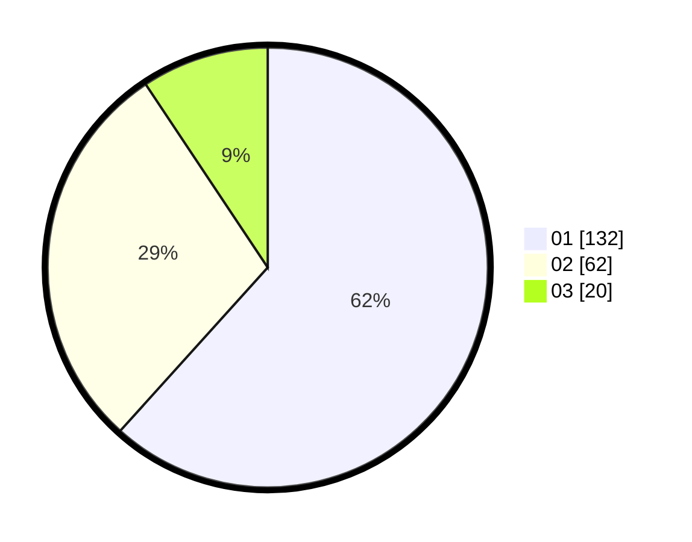

# Hasil

Hasil perolehan suara paslon dapat dilihat pada file paslon-01.txt, paslon-02.txt, dan paslon-03.txt.

Jika tidak ada, artinya data tersebut belum ada pada SIREKAP.

## Perolehan Suara

 * Paslon 01: **132**.
 * Paslon 02: **62**.
 * Paslon 03: **20**.

## Foto C Plano

https://sirekap-obj-formc.kpu.go.id/f56a/pemilu/ppwp/31/74/01/10/06/3174011006060-20240214-192520--655ecdb0-c545-4437-b7b2-90335fcfc6fc.jpg

https://sirekap-obj-formc.kpu.go.id/f56a/pemilu/ppwp/31/74/01/10/06/3174011006060-20240214-192623--9e9e87a8-a106-4d05-9c39-49007db2369e.jpg

https://sirekap-obj-formc.kpu.go.id/f56a/pemilu/ppwp/31/74/01/10/06/3174011006060-20240214-192659--459fff46-5d3c-4d5e-82d4-3adf1e1ef2ab.jpg

## DATA PEMILIH TETAP

Jumlah pemilih dalam DPT: **272**.
 * L: **135**.
 * P: **137**.

## DATA PENGGUNA HAK PILIH

Jumlah pengguna hak pilih dalam DPT: **212**.
 * L: **101**.
 * P: **111**.

Jumlah pengguna hak pilih dalam DPTb: **2**.
 * L: **1**.
 * P: **1**.

Jumlah pengguna hak pilih dalam DPK: **2**.
 * L: **1**.
 * P: **1**.

Jumlah pengguna hak pilih: **216**.
 * L: **103**.
 * P: **113**.

## JUMLAH SUARA SAH DAN TIDAK SAH

JUMLAH SELURUH SUARA SAH: **214**.

JUMLAH SUARA TIDAK SAH: **2**.

JUMLAH SELURUH SUARA SAH DAN SUARA TIDAK SAH: **216**.
