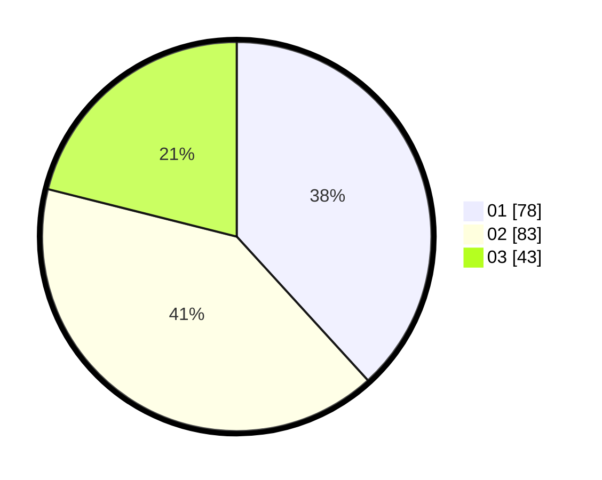

# Hasil

Hasil perolehan suara paslon dapat dilihat pada file paslon-01.txt, paslon-02.txt, dan paslon-03.txt.

Jika tidak ada, artinya data tersebut belum ada pada SIREKAP.

## Perolehan Suara

 * Paslon 01: **78**.
 * Paslon 02: **83**.
 * Paslon 03: **43**.

## Foto C Plano

https://sirekap-obj-formc.kpu.go.id/91c7/pemilu/ppwp/31/74/01/10/06/3174011006069-20240216-210251--660080b0-371f-4f4f-a78d-ea1a2f2eee49.jpg

https://sirekap-obj-formc.kpu.go.id/91c7/pemilu/ppwp/31/74/01/10/06/3174011006069-20240216-210253--7804c594-a16c-4931-afc2-701e9ff1e911.jpg

https://sirekap-obj-formc.kpu.go.id/91c7/pemilu/ppwp/31/74/01/10/06/3174011006069-20240216-210252--b6cc83d0-4e29-47b0-9f7a-94e3ae16adb4.jpg

## DATA PEMILIH TETAP

Jumlah pemilih dalam DPT: **262**.
 * L: **126**.
 * P: **136**.

## DATA PENGGUNA HAK PILIH

Jumlah pengguna hak pilih dalam DPT: **211**.
 * L: **98**.
 * P: **113**.

Jumlah pengguna hak pilih dalam DPTb: **0**.
 * L: **0**.
 * P: **0**.

Jumlah pengguna hak pilih dalam DPK: **0**.
 * L: **0**.
 * P: **0**.

Jumlah pengguna hak pilih: **211**.
 * L: **98**.
 * P: **113**.

## JUMLAH SUARA SAH DAN TIDAK SAH

JUMLAH SELURUH SUARA SAH: **204**.

JUMLAH SUARA TIDAK SAH: **7**.

JUMLAH SELURUH SUARA SAH DAN SUARA TIDAK SAH: **211**.
