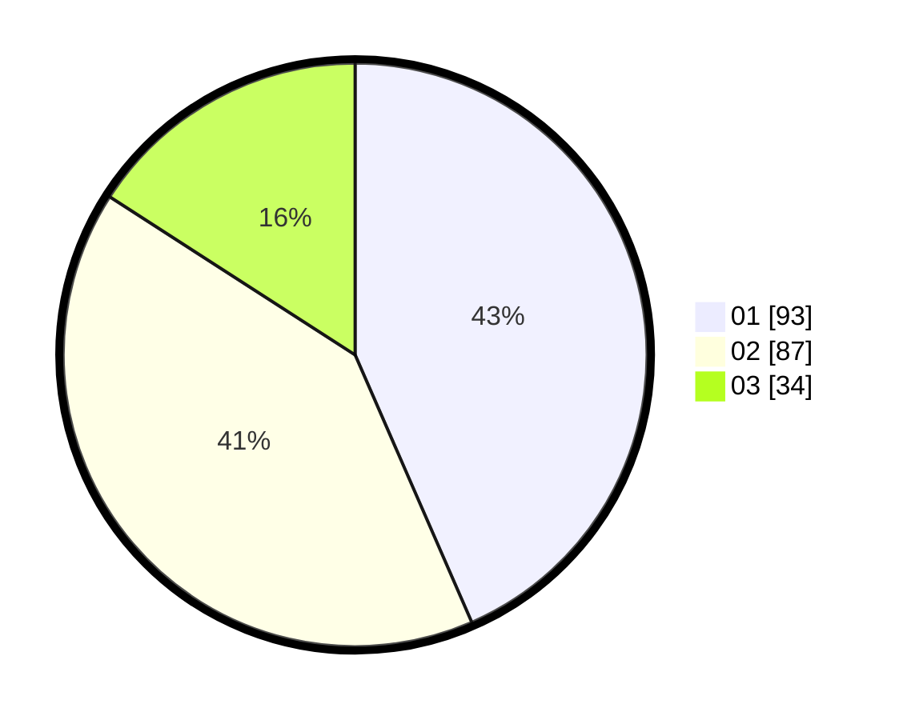

# Hasil

Hasil perolehan suara paslon dapat dilihat pada file paslon-01.txt, paslon-02.txt, dan paslon-03.txt.

Jika tidak ada, artinya data tersebut belum ada pada SIREKAP.

## Perolehan Suara

 * Paslon 01: **93**.
 * Paslon 02: **87**.
 * Paslon 03: **34**.

## Foto C Plano

https://sirekap-obj-formc.kpu.go.id/108c/pemilu/ppwp/31/74/01/10/06/3174011006070-20240214-192110--6b440580-5264-4656-bf1c-fd1fac548267.jpg

https://sirekap-obj-formc.kpu.go.id/108c/pemilu/ppwp/31/74/01/10/06/3174011006070-20240214-192621--66879742-799b-4237-b775-33fee9c95762.jpg

https://sirekap-obj-formc.kpu.go.id/108c/pemilu/ppwp/31/74/01/10/06/3174011006070-20240214-215317--a2aacd41-7eaa-4aa8-bcb1-4bf53cc6bf54.jpg

## DATA PEMILIH TETAP

Jumlah pemilih dalam DPT: **267**.
 * L: **138**.
 * P: **129**.

## DATA PENGGUNA HAK PILIH

Jumlah pengguna hak pilih dalam DPT: **217**.
 * L: **111**.
 * P: **106**.

Jumlah pengguna hak pilih dalam DPTb: **5**.
 * L: **2**.
 * P: **3**.

Jumlah pengguna hak pilih dalam DPK: **0**.
 * L: **0**.
 * P: **0**.

Jumlah pengguna hak pilih: **222**.
 * L: **113**.
 * P: **109**.

## JUMLAH SUARA SAH DAN TIDAK SAH

JUMLAH SELURUH SUARA SAH: **214**.

JUMLAH SUARA TIDAK SAH: **8**.

JUMLAH SELURUH SUARA SAH DAN SUARA TIDAK SAH: **222**.
