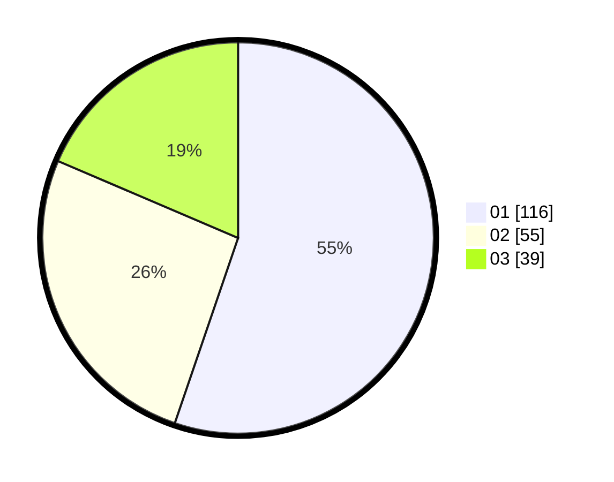

# Hasil

Hasil perolehan suara paslon dapat dilihat pada file paslon-01.txt, paslon-02.txt, dan paslon-03.txt.

Jika tidak ada, artinya data tersebut belum ada pada SIREKAP.

## Perolehan Suara

 * Paslon 01: **116**.
 * Paslon 02: **55**.
 * Paslon 03: **39**.

## Foto C Plano

https://sirekap-obj-formc.kpu.go.id/0448/pemilu/ppwp/31/74/01/10/06/3174011006071-20240214-201350--c5f80e47-658a-4cc2-8a2c-5f52e9f3aba5.jpg

https://sirekap-obj-formc.kpu.go.id/0448/pemilu/ppwp/31/74/01/10/06/3174011006071-20240214-201413--256dac08-50c4-4a99-864d-e2721b88acb2.jpg

https://sirekap-obj-formc.kpu.go.id/0448/pemilu/ppwp/31/74/01/10/06/3174011006071-20240216-135355--12862ea8-a7ed-4335-ab80-202a04613313.jpg

## DATA PEMILIH TETAP

Jumlah pemilih dalam DPT: **267**.
 * L: **122**.
 * P: **145**.

## DATA PENGGUNA HAK PILIH

Jumlah pengguna hak pilih dalam DPT: **209**.
 * L: **94**.
 * P: **115**.

Jumlah pengguna hak pilih dalam DPTb: **2**.
 * L: **0**.
 * P: **2**.

Jumlah pengguna hak pilih dalam DPK: **1**.
 * L: **1**.
 * P: **0**.

Jumlah pengguna hak pilih: **212**.
 * L: **95**.
 * P: **117**.

## JUMLAH SUARA SAH DAN TIDAK SAH

JUMLAH SELURUH SUARA SAH: **210**.

JUMLAH SUARA TIDAK SAH: **2**.

JUMLAH SELURUH SUARA SAH DAN SUARA TIDAK SAH: **212**.
