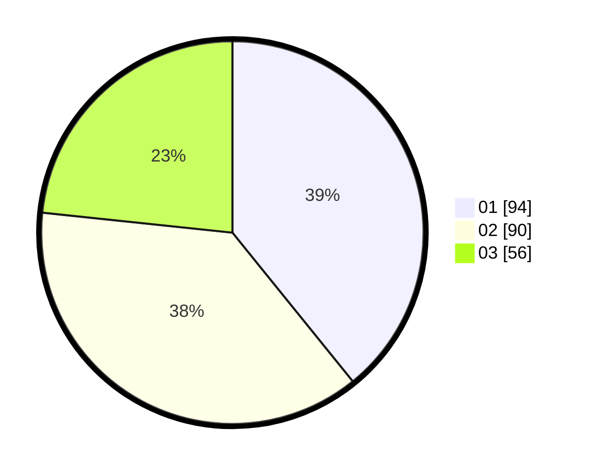

# Hasil

Hasil perolehan suara paslon dapat dilihat pada file paslon-01.txt, paslon-02.txt, dan paslon-03.txt.

Jika tidak ada, artinya data tersebut belum ada pada SIREKAP.

## Perolehan Suara

 * Paslon 01: **94**.
 * Paslon 02: **90**.
 * Paslon 03: **56**.

## Foto C Plano

https://sirekap-obj-formc.kpu.go.id/58e5/pemilu/ppwp/31/74/01/10/06/3174011006072-20240215-102518--cfc533fe-59fb-4333-a74f-c4cf988160c0.jpg

https://sirekap-obj-formc.kpu.go.id/58e5/pemilu/ppwp/31/74/01/10/06/3174011006072-20240215-102933--acb05285-e670-4825-968c-aabfb98ea2a5.jpg

https://sirekap-obj-formc.kpu.go.id/58e5/pemilu/ppwp/31/74/01/10/06/3174011006072-20240215-103045--b639c3a6-1f16-46d5-8e87-0579fbc355df.jpg
