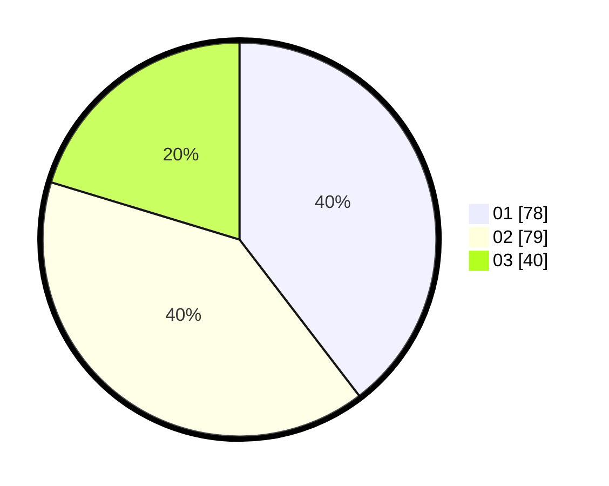

# Hasil

Hasil perolehan suara paslon dapat dilihat pada file paslon-01.txt, paslon-02.txt, dan paslon-03.txt.

Jika tidak ada, artinya data tersebut belum ada pada SIREKAP.

## Perolehan Suara

 * Paslon 01: **78**.
 * Paslon 02: **79**.
 * Paslon 03: **40**.

## Foto C Plano

https://sirekap-obj-formc.kpu.go.id/4401/pemilu/ppwp/31/74/01/10/07/3174011007001-20240216-053212--ad31b116-5906-441b-ab35-e8b7baab832b.jpg

https://sirekap-obj-formc.kpu.go.id/4401/pemilu/ppwp/31/74/01/10/07/3174011007001-20240216-053213--59badd7e-4e0e-46ab-bdb6-af8e1ecd0d57.jpg

https://sirekap-obj-formc.kpu.go.id/4401/pemilu/ppwp/31/74/01/10/07/3174011007001-20240216-053212--c64bd642-4984-4bd9-8295-5366e6bfe9f1.jpg

## DATA PEMILIH TETAP

Jumlah pemilih dalam DPT: **272**.
 * L: **142**.
 * P: **130**.

## DATA PENGGUNA HAK PILIH

Jumlah pengguna hak pilih dalam DPT: **195**.
 * L: **93**.
 * P: **102**.

Jumlah pengguna hak pilih dalam DPTb: **0**.
 * L: **0**.
 * P: **0**.

Jumlah pengguna hak pilih dalam DPK: **2**.
 * L: **1**.
 * P: **1**.

Jumlah pengguna hak pilih: **197**.
 * L: **94**.
 * P: **103**.

## JUMLAH SUARA SAH DAN TIDAK SAH

JUMLAH SELURUH SUARA SAH: **197**.

JUMLAH SUARA TIDAK SAH: **0**.

JUMLAH SELURUH SUARA SAH DAN SUARA TIDAK SAH: **197**.
