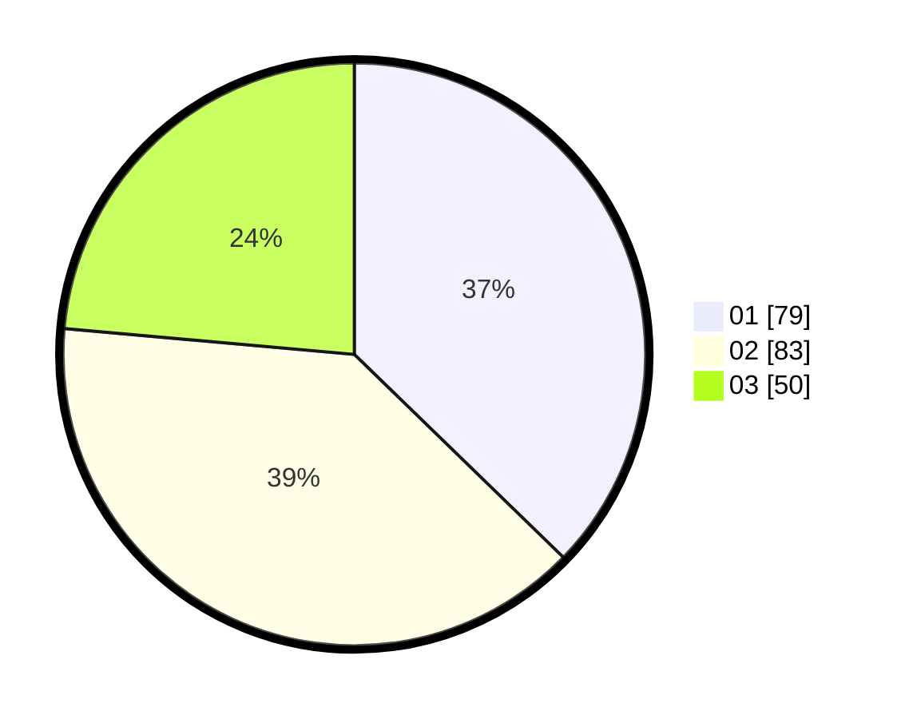

# Hasil

Hasil perolehan suara paslon dapat dilihat pada file paslon-01.txt, paslon-02.txt, dan paslon-03.txt.

Jika tidak ada, artinya data tersebut belum ada pada SIREKAP.

## Perolehan Suara

 * Paslon 01: **79**.
 * Paslon 02: **83**.
 * Paslon 03: **50**.

## Foto C Plano

https://sirekap-obj-formc.kpu.go.id/5166/pemilu/ppwp/31/74/01/10/07/3174011007003-20240215-222849--21359deb-1e4d-4106-b689-e7fce3042d55.jpg

https://sirekap-obj-formc.kpu.go.id/5166/pemilu/ppwp/31/74/01/10/07/3174011007003-20240215-222851--a5874f46-17d1-4936-a8a9-472e683fde74.jpg

https://sirekap-obj-formc.kpu.go.id/5166/pemilu/ppwp/31/74/01/10/07/3174011007003-20240215-222850--6670b4a4-b3f8-448d-aecf-b2d3c2ac41c5.jpg

## DATA PEMILIH TETAP

Jumlah pemilih dalam DPT: **266**.
 * L: **118**.
 * P: **148**.

## DATA PENGGUNA HAK PILIH

Jumlah pengguna hak pilih dalam DPT: **215**.
 * L: **95**.
 * P: **120**.

Jumlah pengguna hak pilih dalam DPTb: **0**.
 * L: **0**.
 * P: **0**.

Jumlah pengguna hak pilih dalam DPK: **0**.
 * L: **0**.
 * P: **0**.

Jumlah pengguna hak pilih: **215**.
 * L: **95**.
 * P: **120**.

## JUMLAH SUARA SAH DAN TIDAK SAH

JUMLAH SELURUH SUARA SAH: **212**.

JUMLAH SUARA TIDAK SAH: **3**.

JUMLAH SELURUH SUARA SAH DAN SUARA TIDAK SAH: **215**.
