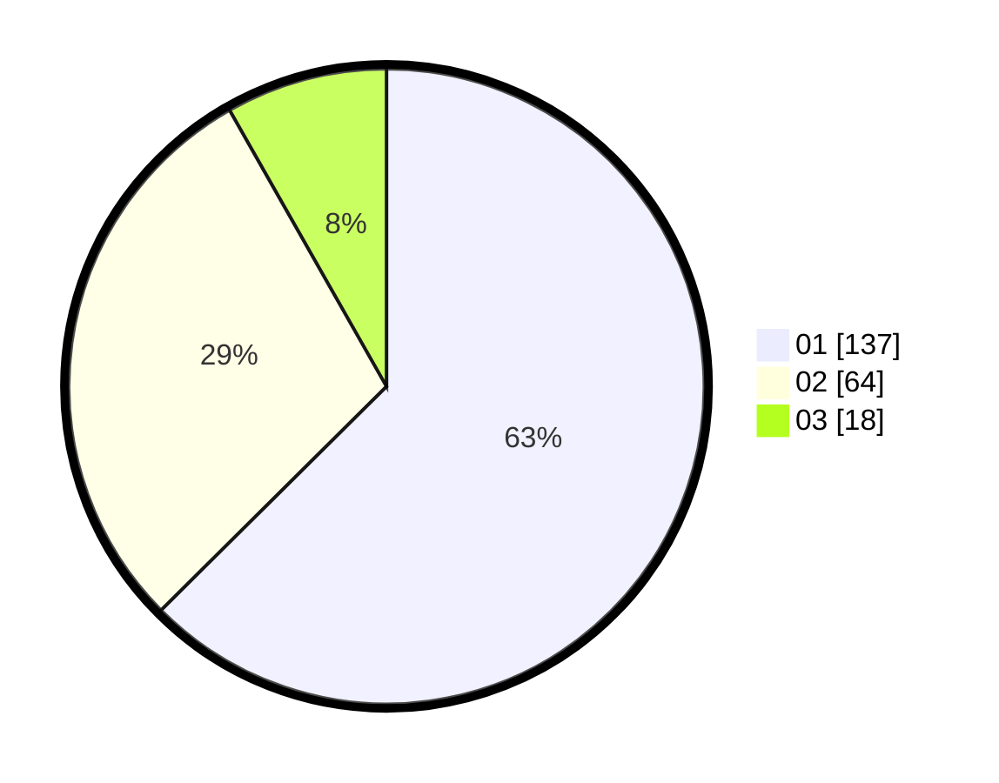

# Hasil

Hasil perolehan suara paslon dapat dilihat pada file paslon-01.txt, paslon-02.txt, dan paslon-03.txt.

Jika tidak ada, artinya data tersebut belum ada pada SIREKAP.

## Perolehan Suara

 * Paslon 01: **137**.
 * Paslon 02: **64**.
 * Paslon 03: **18**.

## Foto C Plano

https://sirekap-obj-formc.kpu.go.id/a407/pemilu/ppwp/31/74/01/10/07/3174011007006-20240214-201319--fc1ffa0d-df5c-4cc7-bc1f-a4d4d500fb94.jpg

https://sirekap-obj-formc.kpu.go.id/a407/pemilu/ppwp/31/74/01/10/07/3174011007006-20240214-205655--6fd62aef-e00c-4746-86fd-f59f7e79fc10.jpg

https://sirekap-obj-formc.kpu.go.id/a407/pemilu/ppwp/31/74/01/10/07/3174011007006-20240216-023844--41949dc7-cd4d-4205-bef8-0b7e23ce56f4.jpg
