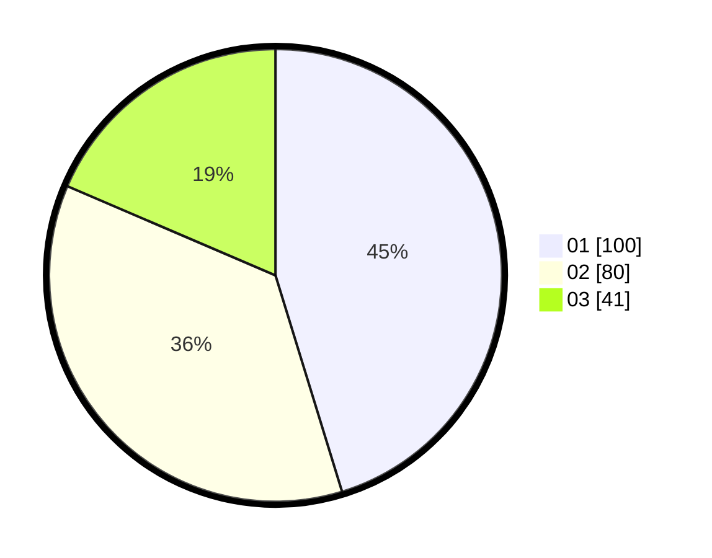

# Hasil

Hasil perolehan suara paslon dapat dilihat pada file paslon-01.txt, paslon-02.txt, dan paslon-03.txt.

Jika tidak ada, artinya data tersebut belum ada pada SIREKAP.

## Perolehan Suara

 * Paslon 01: **100**.
 * Paslon 02: **80**.
 * Paslon 03: **41**.

## Foto C Plano

https://sirekap-obj-formc.kpu.go.id/9479/pemilu/ppwp/31/74/01/10/07/3174011007010-20240214-201344--bf5971a9-47c8-44a8-846b-a6c6a97813d6.jpg

https://sirekap-obj-formc.kpu.go.id/9479/pemilu/ppwp/31/74/01/10/07/3174011007010-20240214-194447--9d5c65a6-efd8-44c1-9f96-4e48c36c1aae.jpg

https://sirekap-obj-formc.kpu.go.id/9479/pemilu/ppwp/31/74/01/10/07/3174011007010-20240214-194544--52aa1c59-dea8-4d52-8b71-f0915346972b.jpg

## DATA PEMILIH TETAP

Jumlah pemilih dalam DPT: **281**.
 * L: **136**.
 * P: **145**.

## DATA PENGGUNA HAK PILIH

Jumlah pengguna hak pilih dalam DPT: **220**.
 * L: **102**.
 * P: **118**.

Jumlah pengguna hak pilih dalam DPTb: **3**.
 * L: **3**.
 * P: **0**.

Jumlah pengguna hak pilih dalam DPK: **4**.
 * L: **3**.
 * P: **1**.

Jumlah pengguna hak pilih: **227**.
 * L: **103**.
 * P: **119**.

## JUMLAH SUARA SAH DAN TIDAK SAH

JUMLAH SELURUH SUARA SAH: **221**.

JUMLAH SUARA TIDAK SAH: **6**.

JUMLAH SELURUH SUARA SAH DAN SUARA TIDAK SAH: **227**.
