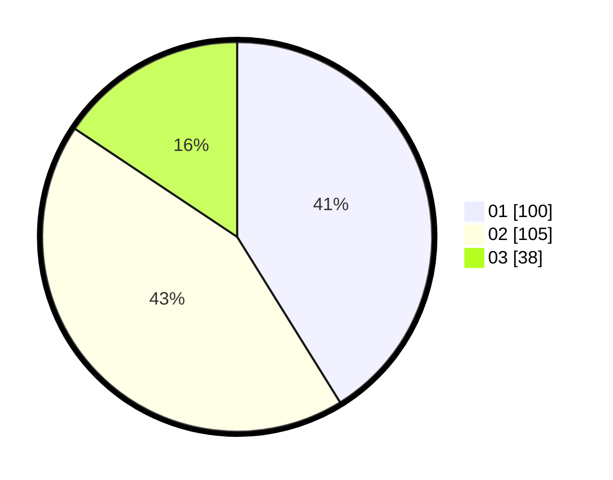

# Hasil

Hasil perolehan suara paslon dapat dilihat pada file paslon-01.txt, paslon-02.txt, dan paslon-03.txt.

Jika tidak ada, artinya data tersebut belum ada pada SIREKAP.

## Perolehan Suara

 * Paslon 01: **100**.
 * Paslon 02: **105**.
 * Paslon 03: **38**.

## Foto C Plano

https://sirekap-obj-formc.kpu.go.id/e51a/pemilu/ppwp/31/74/01/10/07/3174011007014-20240214-210553--f51cffdf-3855-4a95-afd7-26e57b4ddcb2.jpg

https://sirekap-obj-formc.kpu.go.id/e51a/pemilu/ppwp/31/74/01/10/07/3174011007014-20240214-210625--fe774bc8-ebae-47ef-aa31-18fcf9387082.jpg

https://sirekap-obj-formc.kpu.go.id/e51a/pemilu/ppwp/31/74/01/10/07/3174011007014-20240214-210634--3cc74429-1c8f-46ae-8874-811e6f75ba5b.jpg

## DATA PEMILIH TETAP

Jumlah pemilih dalam DPT: **242**.
 * L: **107**.
 * P: **135**.

## DATA PENGGUNA HAK PILIH

Jumlah pengguna hak pilih dalam DPT: **242**.
 * L: **107**.
 * P: **135**.

Jumlah pengguna hak pilih dalam DPTb: **3**.
 * L: **1**.
 * P: **2**.

Jumlah pengguna hak pilih dalam DPK: **3**.
 * L: **1**.
 * P: **2**.

Jumlah pengguna hak pilih: **248**.
 * L: **109**.
 * P: **138**.

## JUMLAH SUARA SAH DAN TIDAK SAH

JUMLAH SELURUH SUARA SAH: **243**.

JUMLAH SUARA TIDAK SAH: **5**.

JUMLAH SELURUH SUARA SAH DAN SUARA TIDAK SAH: **248**.
