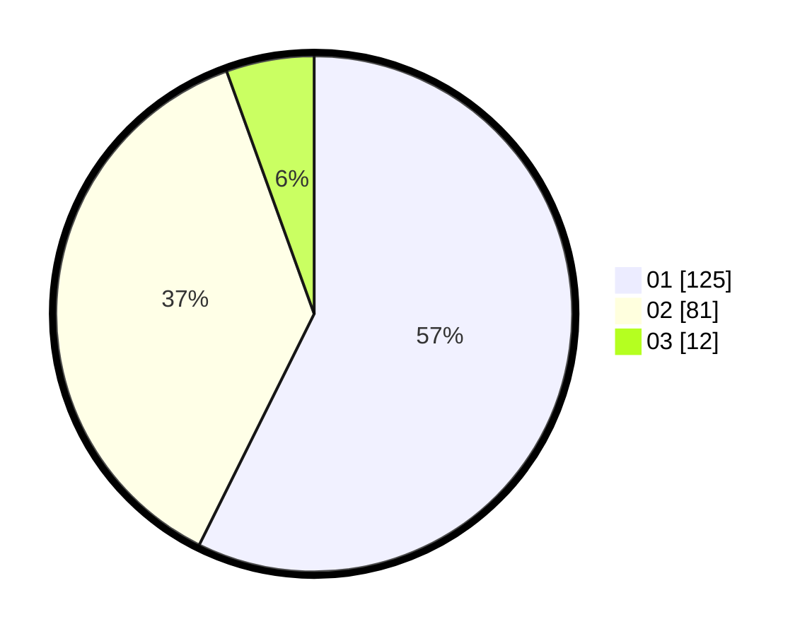

# Hasil

Hasil perolehan suara paslon dapat dilihat pada file paslon-01.txt, paslon-02.txt, dan paslon-03.txt.

Jika tidak ada, artinya data tersebut belum ada pada SIREKAP.

## Perolehan Suara

 * Paslon 01: **125**.
 * Paslon 02: **81**.
 * Paslon 03: **12**.

## Foto C Plano

https://sirekap-obj-formc.kpu.go.id/f76d/pemilu/ppwp/31/74/01/10/07/3174011007019-20240214-204327--435114e7-4f5d-4115-ab08-78f7db785e0b.jpg

https://sirekap-obj-formc.kpu.go.id/f76d/pemilu/ppwp/31/74/01/10/07/3174011007019-20240214-213715--48324f96-2f48-42ef-866b-0432d44ddaa6.jpg

https://sirekap-obj-formc.kpu.go.id/f76d/pemilu/ppwp/31/74/01/10/07/3174011007019-20240214-204624--9154d305-c07d-4c99-b65f-1d4d55c84f6a.jpg

## DATA PEMILIH TETAP

Jumlah pemilih dalam DPT: **268**.
 * L: **136**.
 * P: **132**.

## DATA PENGGUNA HAK PILIH

Jumlah pengguna hak pilih dalam DPT: **218**.
 * L: **107**.
 * P: **111**.

Jumlah pengguna hak pilih dalam DPTb: **0**.
 * L: **0**.
 * P: **0**.

Jumlah pengguna hak pilih dalam DPK: **2**.
 * L: **0**.
 * P: **2**.

Jumlah pengguna hak pilih: **220**.
 * L: **107**.
 * P: **113**.

## JUMLAH SUARA SAH DAN TIDAK SAH

JUMLAH SELURUH SUARA SAH: **218**.

JUMLAH SUARA TIDAK SAH: **2**.

JUMLAH SELURUH SUARA SAH DAN SUARA TIDAK SAH: **220**.
