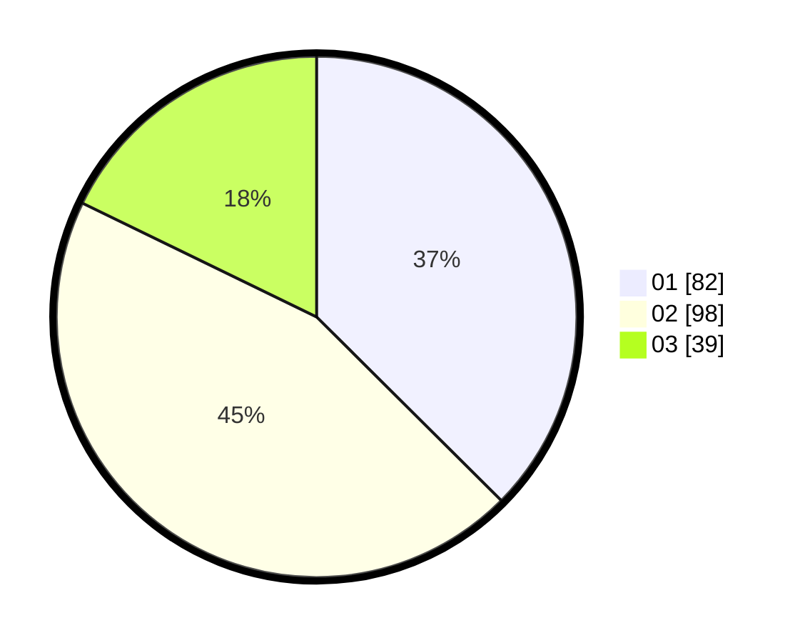

# Hasil

Hasil perolehan suara paslon dapat dilihat pada file paslon-01.txt, paslon-02.txt, dan paslon-03.txt.

Jika tidak ada, artinya data tersebut belum ada pada SIREKAP.

## Perolehan Suara

 * Paslon 01: **82**.
 * Paslon 02: **98**.
 * Paslon 03: **39**.

## Foto C Plano

https://sirekap-obj-formc.kpu.go.id/dce9/pemilu/ppwp/31/74/01/10/07/3174011007022-20240218-213628--66cc7094-89b0-42e3-9c1a-aedebde20518.jpg

https://sirekap-obj-formc.kpu.go.id/dce9/pemilu/ppwp/31/74/01/10/07/3174011007022-20240218-214827--c55e6303-1264-4fcc-8512-200add3c8cfd.jpg

https://sirekap-obj-formc.kpu.go.id/dce9/pemilu/ppwp/31/74/01/10/07/3174011007022-20240218-215241--d1673045-e09e-482e-8672-5dea171e67c5.jpg

## DATA PEMILIH TETAP

Jumlah pemilih dalam DPT: **273**.
 * L: **142**.
 * P: **131**.

## DATA PENGGUNA HAK PILIH

Jumlah pengguna hak pilih dalam DPT: **220**.
 * L: **112**.
 * P: **108**.

Jumlah pengguna hak pilih dalam DPTb: **0**.
 * L: **0**.
 * P: **0**.

Jumlah pengguna hak pilih dalam DPK: **0**.
 * L: **0**.
 * P: **0**.

Jumlah pengguna hak pilih: **220**.
 * L: **112**.
 * P: **108**.

## JUMLAH SUARA SAH DAN TIDAK SAH

JUMLAH SELURUH SUARA SAH: **219**.

JUMLAH SUARA TIDAK SAH: **1**.

JUMLAH SELURUH SUARA SAH DAN SUARA TIDAK SAH: **220**.
