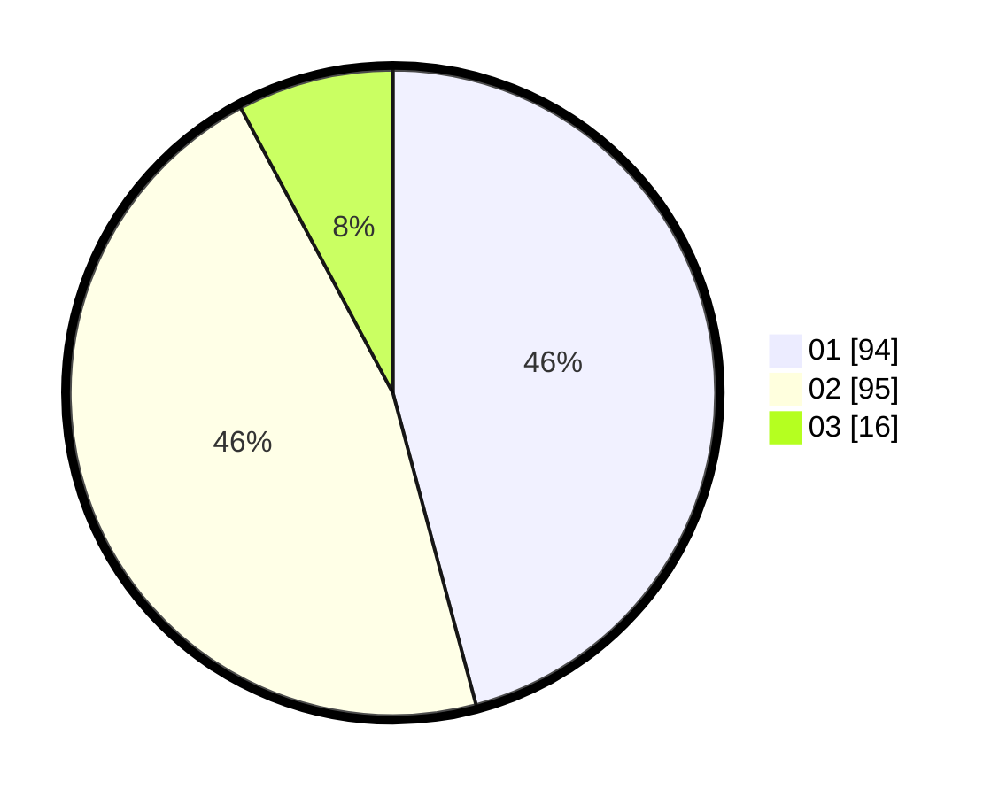

# Hasil

Hasil perolehan suara paslon dapat dilihat pada file paslon-01.txt, paslon-02.txt, dan paslon-03.txt.

Jika tidak ada, artinya data tersebut belum ada pada SIREKAP.

## Perolehan Suara

 * Paslon 01: **94**.
 * Paslon 02: **95**.
 * Paslon 03: **16**.

## Foto C Plano

https://sirekap-obj-formc.kpu.go.id/c46d/pemilu/ppwp/31/74/01/10/07/3174011007033-20240214-194724--0245ea35-3043-4c6e-bcaa-2b4778c30061.jpg

https://sirekap-obj-formc.kpu.go.id/c46d/pemilu/ppwp/31/74/01/10/07/3174011007033-20240214-194731--aa6e7c7e-be94-41a7-9ffa-1e00e7afabac.jpg

https://sirekap-obj-formc.kpu.go.id/c46d/pemilu/ppwp/31/74/01/10/07/3174011007033-20240214-194738--632898fd-6a03-471e-8f1e-29af7663e88b.jpg

## DATA PEMILIH TETAP

Jumlah pemilih dalam DPT: **271**.
 * L: **136**.
 * P: **135**.

## DATA PENGGUNA HAK PILIH

Jumlah pengguna hak pilih dalam DPT: **206**.
 * L: **102**.
 * P: **104**.

Jumlah pengguna hak pilih dalam DPTb: **3**.
 * L: **2**.
 * P: **1**.

Jumlah pengguna hak pilih dalam DPK: **0**.
 * L: **0**.
 * P: **0**.

Jumlah pengguna hak pilih: **209**.
 * L: **104**.
 * P: **105**.

## JUMLAH SUARA SAH DAN TIDAK SAH

JUMLAH SELURUH SUARA SAH: **205**.

JUMLAH SUARA TIDAK SAH: **4**.

JUMLAH SELURUH SUARA SAH DAN SUARA TIDAK SAH: **209**.
