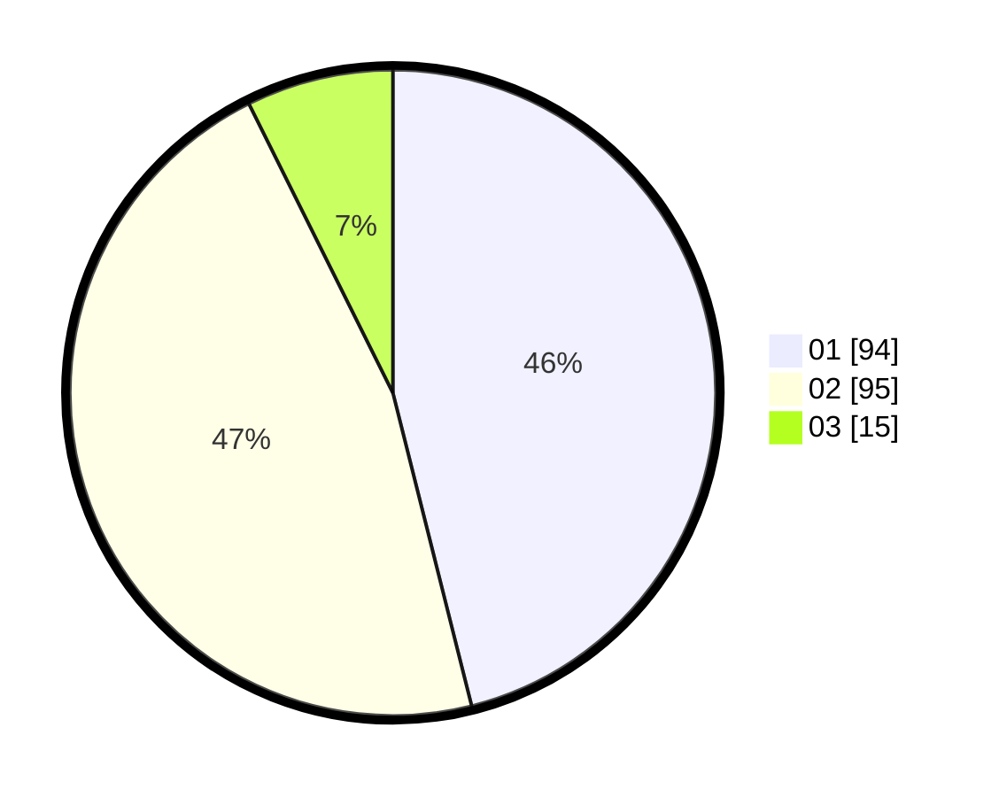

# Hasil

Hasil perolehan suara paslon dapat dilihat pada file paslon-01.txt, paslon-02.txt, dan paslon-03.txt.

Jika tidak ada, artinya data tersebut belum ada pada SIREKAP.

## Perolehan Suara

 * Paslon 01: **94**.
 * Paslon 02: **95**.
 * Paslon 03: **15**.

## Foto C Plano

https://sirekap-obj-formc.kpu.go.id/f430/pemilu/ppwp/31/74/01/10/07/3174011007034-20240214-155629--271dfd38-d033-472a-8297-46f3b2c2fda2.jpg

https://sirekap-obj-formc.kpu.go.id/f430/pemilu/ppwp/31/74/01/10/07/3174011007034-20240214-192126--e1c1506a-6530-49e2-b774-dc5900e77121.jpg

https://sirekap-obj-formc.kpu.go.id/f430/pemilu/ppwp/31/74/01/10/07/3174011007034-20240214-155459--8cf2b6ac-c219-4615-bc5f-437730e96f9e.jpg

## DATA PEMILIH TETAP

Jumlah pemilih dalam DPT: **286**.
 * L: **144**.
 * P: **142**.

## DATA PENGGUNA HAK PILIH

Jumlah pengguna hak pilih dalam DPT: **207**.
 * L: **106**.
 * P: **101**.

Jumlah pengguna hak pilih dalam DPTb: **0**.
 * L: **0**.
 * P: **0**.

Jumlah pengguna hak pilih dalam DPK: **0**.
 * L: **0**.
 * P: **0**.

Jumlah pengguna hak pilih: **207**.
 * L: **106**.
 * P: **101**.

## JUMLAH SUARA SAH DAN TIDAK SAH

JUMLAH SELURUH SUARA SAH: **204**.

JUMLAH SUARA TIDAK SAH: **3**.

JUMLAH SELURUH SUARA SAH DAN SUARA TIDAK SAH: **207**.
