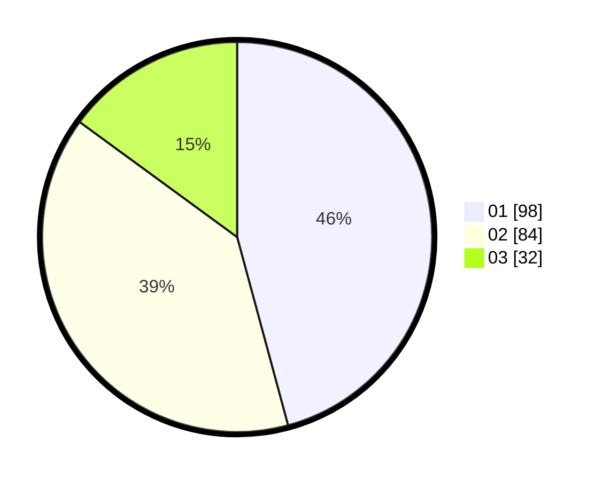

# Hasil

Hasil perolehan suara paslon dapat dilihat pada file paslon-01.txt, paslon-02.txt, dan paslon-03.txt.

Jika tidak ada, artinya data tersebut belum ada pada SIREKAP.

## Perolehan Suara

 * Paslon 01: **98**.
 * Paslon 02: **84**.
 * Paslon 03: **32**.

## Foto C Plano

https://sirekap-obj-formc.kpu.go.id/7823/pemilu/ppwp/31/74/01/10/07/3174011007038-20240215-193621--acc20349-dc6d-46dc-9885-d1ddcff6bb6e.jpg

https://sirekap-obj-formc.kpu.go.id/7823/pemilu/ppwp/31/74/01/10/07/3174011007038-20240215-193642--d29a8639-1657-431b-8815-c7ce2cf71906.jpg

https://sirekap-obj-formc.kpu.go.id/7823/pemilu/ppwp/31/74/01/10/07/3174011007038-20240215-193631--be9f37aa-8597-4d1b-91e2-d0c92cb56ce2.jpg

## DATA PEMILIH TETAP

Jumlah pemilih dalam DPT: **263**.
 * L: **131**.
 * P: **132**.

## DATA PENGGUNA HAK PILIH

Jumlah pengguna hak pilih dalam DPT: **217**.
 * L: **103**.
 * P: **114**.

Jumlah pengguna hak pilih dalam DPTb: **0**.
 * L: **0**.
 * P: **0**.

Jumlah pengguna hak pilih dalam DPK: **2**.
 * L: **0**.
 * P: **2**.

Jumlah pengguna hak pilih: **219**.
 * L: **103**.
 * P: **116**.

## JUMLAH SUARA SAH DAN TIDAK SAH

JUMLAH SELURUH SUARA SAH: **214**.

JUMLAH SUARA TIDAK SAH: **5**.

JUMLAH SELURUH SUARA SAH DAN SUARA TIDAK SAH: **219**.
