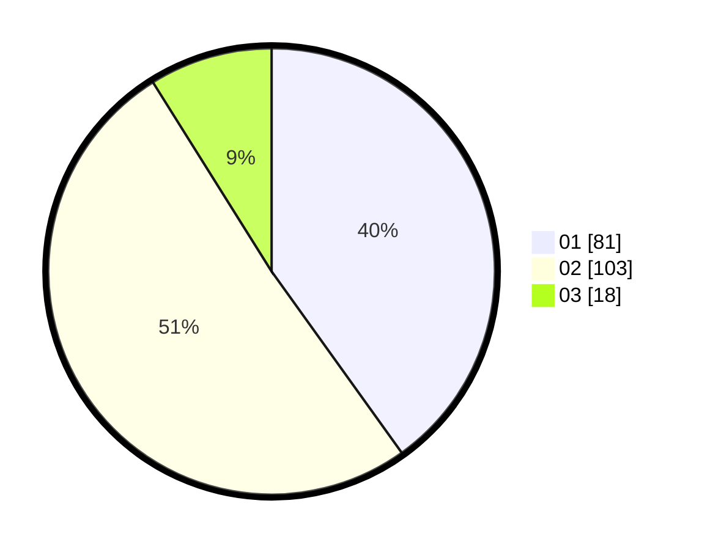

# Hasil

Hasil perolehan suara paslon dapat dilihat pada file paslon-01.txt, paslon-02.txt, dan paslon-03.txt.

Jika tidak ada, artinya data tersebut belum ada pada SIREKAP.

## Perolehan Suara

 * Paslon 01: **81**.
 * Paslon 02: **103**.
 * Paslon 03: **18**.

## Foto C Plano

https://sirekap-obj-formc.kpu.go.id/689f/pemilu/ppwp/31/74/01/10/07/3174011007043-20240216-143736--892981be-9441-4ece-ac5f-4a939de3593f.jpg

https://sirekap-obj-formc.kpu.go.id/689f/pemilu/ppwp/31/74/01/10/07/3174011007043-20240216-144421--083acbb2-6063-497b-a2d9-bf5509db50bd.jpg

https://sirekap-obj-formc.kpu.go.id/689f/pemilu/ppwp/31/74/01/10/07/3174011007043-20240215-000149--b79e51b2-4c3a-465d-bbab-dc57797d3b5d.jpg

## DATA PEMILIH TETAP

Jumlah pemilih dalam DPT: **266**.
 * L: **143**.
 * P: **123**.

## DATA PENGGUNA HAK PILIH

Jumlah pengguna hak pilih dalam DPT: **204**.
 * L: **103**.
 * P: **101**.

Jumlah pengguna hak pilih dalam DPTb: **0**.
 * L: **0**.
 * P: **0**.

Jumlah pengguna hak pilih dalam DPK: **0**.
 * L: **0**.
 * P: **0**.

Jumlah pengguna hak pilih: **204**.
 * L: **103**.
 * P: **101**.

## JUMLAH SUARA SAH DAN TIDAK SAH

JUMLAH SELURUH SUARA SAH: **202**.

JUMLAH SUARA TIDAK SAH: **2**.

JUMLAH SELURUH SUARA SAH DAN SUARA TIDAK SAH: **204**.
