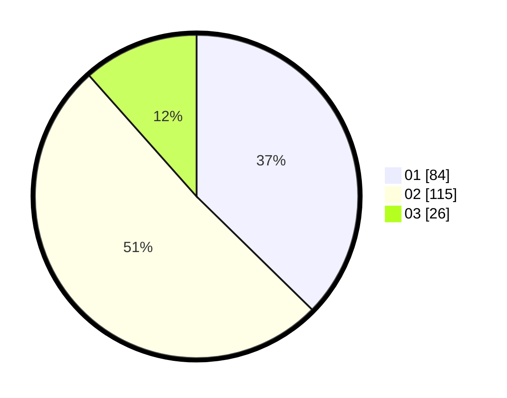

# Hasil

Hasil perolehan suara paslon dapat dilihat pada file paslon-01.txt, paslon-02.txt, dan paslon-03.txt.

Jika tidak ada, artinya data tersebut belum ada pada SIREKAP.

## Perolehan Suara

 * Paslon 01: **84**.
 * Paslon 02: **115**.
 * Paslon 03: **26**.

## Foto C Plano

https://sirekap-obj-formc.kpu.go.id/37c2/pemilu/ppwp/31/74/01/10/07/3174011007045-20240214-235028--7c6a04c9-5191-4c15-934b-f439a380cafd.jpg

https://sirekap-obj-formc.kpu.go.id/37c2/pemilu/ppwp/31/74/01/10/07/3174011007045-20240215-000023--abff5857-31ce-4401-9295-cf3152be1bae.jpg

https://sirekap-obj-formc.kpu.go.id/37c2/pemilu/ppwp/31/74/01/10/07/3174011007045-20240215-000047--1bd42bd0-0648-4f6f-bb89-e890d52dad11.jpg
