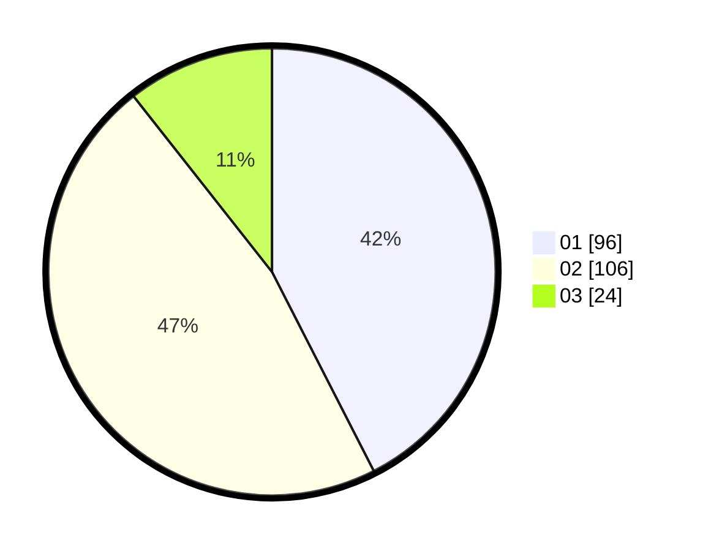

# Hasil

Hasil perolehan suara paslon dapat dilihat pada file paslon-01.txt, paslon-02.txt, dan paslon-03.txt.

Jika tidak ada, artinya data tersebut belum ada pada SIREKAP.

## Perolehan Suara

 * Paslon 01: **96**.
 * Paslon 02: **106**.
 * Paslon 03: **24**.

## Foto C Plano

https://sirekap-obj-formc.kpu.go.id/1e76/pemilu/ppwp/31/74/01/10/07/3174011007047-20240215-031346--d9132bfb-c44a-4789-9529-2ff6fcdf9a83.jpg

https://sirekap-obj-formc.kpu.go.id/1e76/pemilu/ppwp/31/74/01/10/07/3174011007047-20240215-031728--f58b6792-15df-42fd-a41c-e0adcf5b1f12.jpg

https://sirekap-obj-formc.kpu.go.id/1e76/pemilu/ppwp/31/74/01/10/07/3174011007047-20240215-031208--cdd5358b-feff-4994-905f-e260e39b3937.jpg

## DATA PEMILIH TETAP

Jumlah pemilih dalam DPT: **274**.
 * L: **138**.
 * P: **136**.

## DATA PENGGUNA HAK PILIH

Jumlah pengguna hak pilih dalam DPT: **226**.
 * L: **113**.
 * P: **113**.

Jumlah pengguna hak pilih dalam DPTb: **4**.
 * L: **3**.
 * P: **1**.

Jumlah pengguna hak pilih dalam DPK: **0**.
 * L: **0**.
 * P: **0**.

Jumlah pengguna hak pilih: **230**.
 * L: **116**.
 * P: **114**.

## JUMLAH SUARA SAH DAN TIDAK SAH

JUMLAH SELURUH SUARA SAH: **226**.

JUMLAH SUARA TIDAK SAH: **3**.

JUMLAH SELURUH SUARA SAH DAN SUARA TIDAK SAH: **229**.
