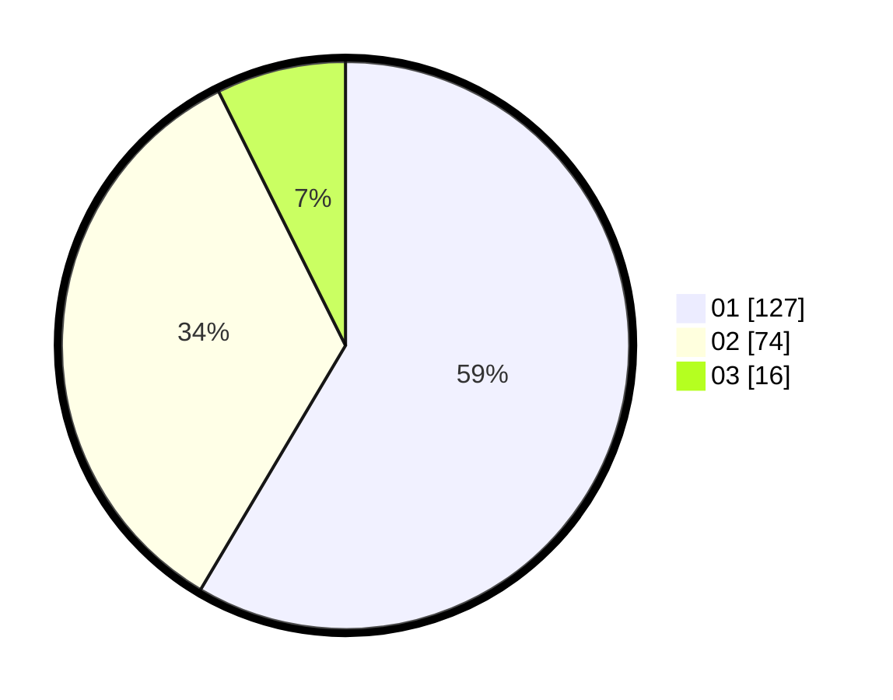

# Hasil

Hasil perolehan suara paslon dapat dilihat pada file paslon-01.txt, paslon-02.txt, dan paslon-03.txt.

Jika tidak ada, artinya data tersebut belum ada pada SIREKAP.

## Perolehan Suara

 * Paslon 01: **127**.
 * Paslon 02: **74**.
 * Paslon 03: **16**.

## Foto C Plano

https://sirekap-obj-formc.kpu.go.id/e214/pemilu/ppwp/31/74/01/10/07/3174011007062-20240214-230937--bbe21306-168c-4732-9a7f-a113dc7233ef.jpg

https://sirekap-obj-formc.kpu.go.id/e214/pemilu/ppwp/31/74/01/10/07/3174011007062-20240214-225133--fbf4404f-cf84-4365-9f68-56f19c686cac.jpg

https://sirekap-obj-formc.kpu.go.id/e214/pemilu/ppwp/31/74/01/10/07/3174011007062-20240214-225201--a91a390f-5c1a-4cbb-bfca-1af4028d936c.jpg

## DATA PEMILIH TETAP

Jumlah pemilih dalam DPT: **272**.
 * L: **128**.
 * P: **144**.

## DATA PENGGUNA HAK PILIH

Jumlah pengguna hak pilih dalam DPT: **218**.
 * L: **103**.
 * P: **125**.

Jumlah pengguna hak pilih dalam DPTb: **0**.
 * L: **0**.
 * P: **0**.

Jumlah pengguna hak pilih dalam DPK: **1**.
 * L: **1**.
 * P: **0**.

Jumlah pengguna hak pilih: **219**.
 * L: **104**.
 * P: **115**.

## JUMLAH SUARA SAH DAN TIDAK SAH

JUMLAH SELURUH SUARA SAH: **217**.

JUMLAH SUARA TIDAK SAH: **2**.

JUMLAH SELURUH SUARA SAH DAN SUARA TIDAK SAH: **219**.
