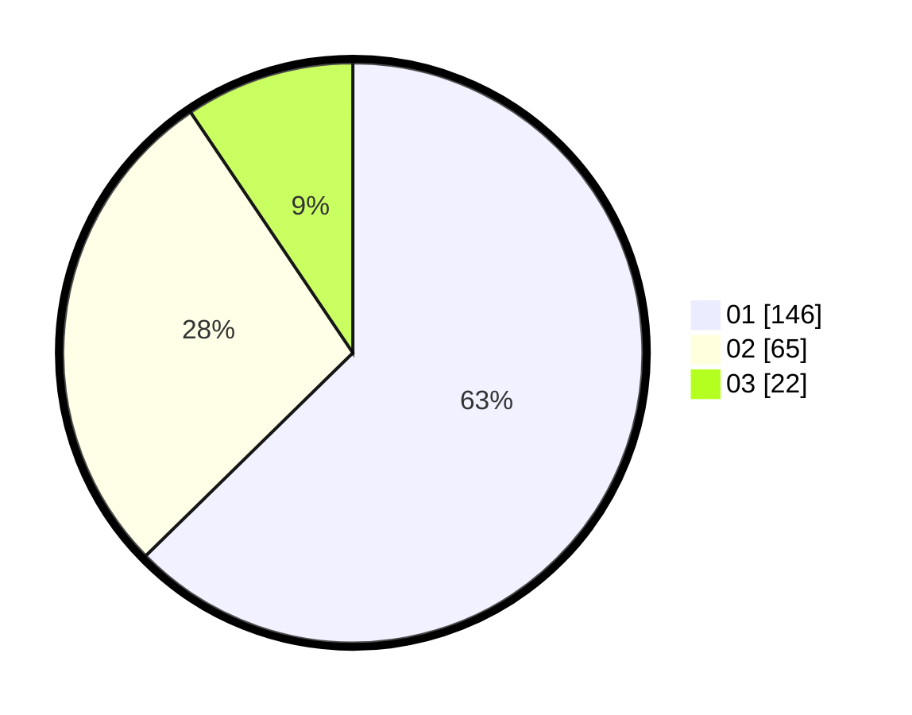

# Hasil

Hasil perolehan suara paslon dapat dilihat pada file paslon-01.txt, paslon-02.txt, dan paslon-03.txt.

Jika tidak ada, artinya data tersebut belum ada pada SIREKAP.

## Perolehan Suara

 * Paslon 01: **146**.
 * Paslon 02: **65**.
 * Paslon 03: **22**.

## Foto C Plano

https://sirekap-obj-formc.kpu.go.id/d46a/pemilu/ppwp/31/74/01/10/07/3174011007063-20240214-193016--b1b1ab84-9b92-4fa8-bd44-4bd291296f50.jpg

https://sirekap-obj-formc.kpu.go.id/d46a/pemilu/ppwp/31/74/01/10/07/3174011007063-20240214-193150--1c99538a-97cb-48b4-acd4-1d27c2a4d9eb.jpg

https://sirekap-obj-formc.kpu.go.id/d46a/pemilu/ppwp/31/74/01/10/07/3174011007063-20240214-193234--4c7a88a6-d591-4de9-90e4-715da6038c11.jpg

## DATA PEMILIH TETAP

Jumlah pemilih dalam DPT: **287**.
 * L: **140**.
 * P: **147**.

## DATA PENGGUNA HAK PILIH

Jumlah pengguna hak pilih dalam DPT: **234**.
 * L: **117**.
 * P: **117**.

Jumlah pengguna hak pilih dalam DPTb: **3**.
 * L: **1**.
 * P: **2**.

Jumlah pengguna hak pilih dalam DPK: **0**.
 * L: **0**.
 * P: **0**.

Jumlah pengguna hak pilih: **237**.
 * L: **118**.
 * P: **119**.

## JUMLAH SUARA SAH DAN TIDAK SAH

JUMLAH SELURUH SUARA SAH: **233**.

JUMLAH SUARA TIDAK SAH: **4**.

JUMLAH SELURUH SUARA SAH DAN SUARA TIDAK SAH: **237**.
