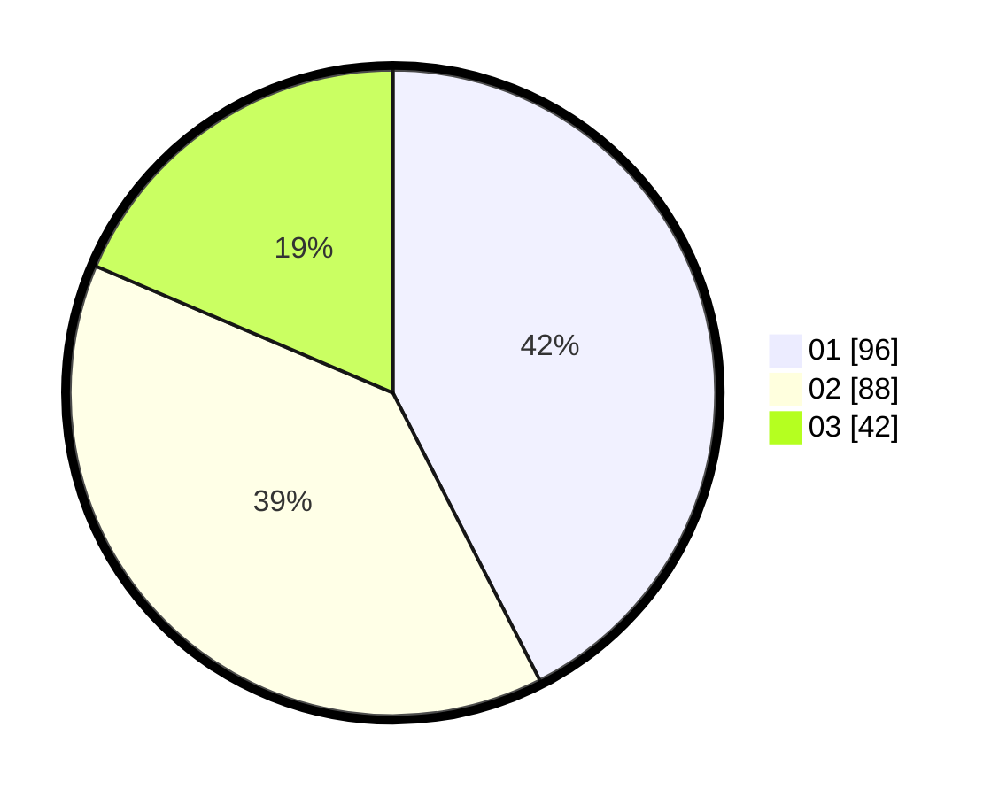

# Hasil

Hasil perolehan suara paslon dapat dilihat pada file paslon-01.txt, paslon-02.txt, dan paslon-03.txt.

Jika tidak ada, artinya data tersebut belum ada pada SIREKAP.

## Perolehan Suara

 * Paslon 01: **96**.
 * Paslon 02: **88**.
 * Paslon 03: **42**.

## Foto C Plano

https://sirekap-obj-formc.kpu.go.id/b40b/pemilu/ppwp/31/74/01/10/07/3174011007075-20240214-162221--2731ab4a-e738-4425-b88b-4499a31238fd.jpg

https://sirekap-obj-formc.kpu.go.id/b40b/pemilu/ppwp/31/74/01/10/07/3174011007075-20240214-155354--6ed116a3-06ba-4758-b4d7-f121c77b3ce7.jpg

https://sirekap-obj-formc.kpu.go.id/b40b/pemilu/ppwp/31/74/01/10/07/3174011007075-20240214-191318--19235ed1-361c-42f1-9af3-5b2f8705be35.jpg

## DATA PEMILIH TETAP

Jumlah pemilih dalam DPT: **277**.
 * L: **143**.
 * P: **134**.

## DATA PENGGUNA HAK PILIH

Jumlah pengguna hak pilih dalam DPT: **217**.
 * L: **109**.
 * P: **108**.

Jumlah pengguna hak pilih dalam DPTb: **8**.
 * L: **3**.
 * P: **5**.

Jumlah pengguna hak pilih dalam DPK: **3**.
 * L: **0**.
 * P: **3**.

Jumlah pengguna hak pilih: **228**.
 * L: **112**.
 * P: **116**.

## JUMLAH SUARA SAH DAN TIDAK SAH

JUMLAH SELURUH SUARA SAH: **226**.

JUMLAH SUARA TIDAK SAH: **3**.

JUMLAH SELURUH SUARA SAH DAN SUARA TIDAK SAH: **229**.
