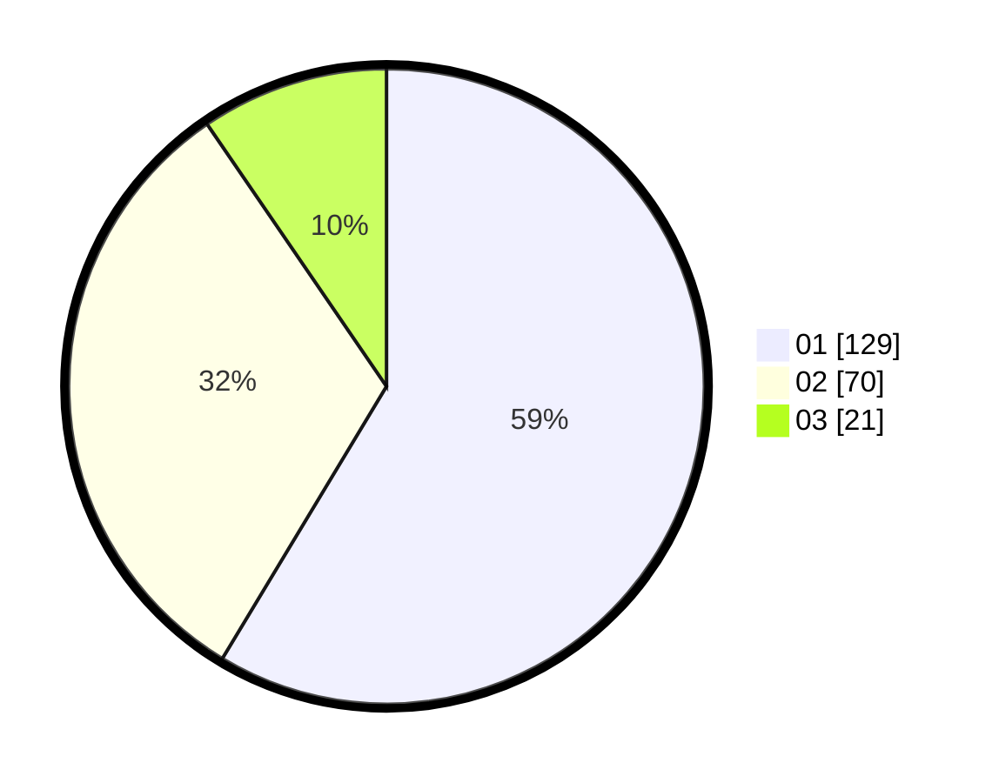

# Hasil

Hasil perolehan suara paslon dapat dilihat pada file paslon-01.txt, paslon-02.txt, dan paslon-03.txt.

Jika tidak ada, artinya data tersebut belum ada pada SIREKAP.

## Perolehan Suara

 * Paslon 01: **129**.
 * Paslon 02: **70**.
 * Paslon 03: **21**.

## Foto C Plano

https://sirekap-obj-formc.kpu.go.id/3f03/pemilu/ppwp/31/74/01/10/07/3174011007082-20240215-141339--448c4ab5-ed3a-48b6-8836-77c6d5044ef6.jpg

https://sirekap-obj-formc.kpu.go.id/3f03/pemilu/ppwp/31/74/01/10/07/3174011007082-20240216-130859--aaba3a8f-08e3-4d7d-8bb9-70bfd9588cfa.jpg

https://sirekap-obj-formc.kpu.go.id/3f03/pemilu/ppwp/31/74/01/10/07/3174011007082-20240216-083349--2ee78432-6651-4b50-b761-a2a9d4ed4736.jpg

## DATA PEMILIH TETAP

Jumlah pemilih dalam DPT: **269**.
 * L: **133**.
 * P: **136**.

## DATA PENGGUNA HAK PILIH

Jumlah pengguna hak pilih dalam DPT: **222**.
 * L: **103**.
 * P: **119**.

Jumlah pengguna hak pilih dalam DPTb: **0**.
 * L: **0**.
 * P: **0**.

Jumlah pengguna hak pilih dalam DPK: **0**.
 * L: **0**.
 * P: **0**.

Jumlah pengguna hak pilih: **222**.
 * L: **103**.
 * P: **119**.

## JUMLAH SUARA SAH DAN TIDAK SAH

JUMLAH SELURUH SUARA SAH: **220**.

JUMLAH SUARA TIDAK SAH: **2**.

JUMLAH SELURUH SUARA SAH DAN SUARA TIDAK SAH: **222**.
