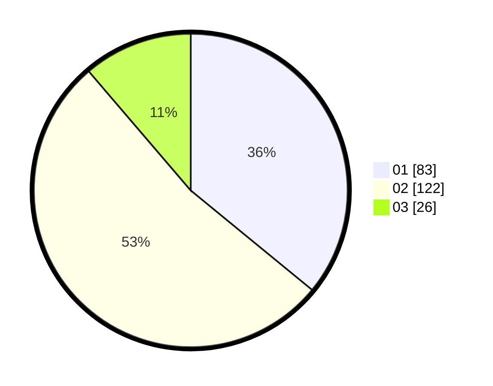

# Hasil

Hasil perolehan suara paslon dapat dilihat pada file paslon-01.txt, paslon-02.txt, dan paslon-03.txt.

Jika tidak ada, artinya data tersebut belum ada pada SIREKAP.

## Perolehan Suara

 * Paslon 01: **83**.
 * Paslon 02: **122**.
 * Paslon 03: **26**.

## Foto C Plano

https://sirekap-obj-formc.kpu.go.id/18dc/pemilu/ppwp/31/74/01/10/07/3174011007088-20240216-154629--38cb46d0-06b2-40c2-9bcd-48a1c1dd9ad9.jpg

https://sirekap-obj-formc.kpu.go.id/18dc/pemilu/ppwp/31/74/01/10/07/3174011007088-20240216-154631--e78216e2-e9f0-473a-bb83-6ff9b2f70549.jpg

https://sirekap-obj-formc.kpu.go.id/18dc/pemilu/ppwp/31/74/01/10/07/3174011007088-20240216-154630--d1030030-0cad-4003-aa6f-a86f6a64ae62.jpg

## DATA PEMILIH TETAP

Jumlah pemilih dalam DPT: **280**.
 * L: **143**.
 * P: **137**.

## DATA PENGGUNA HAK PILIH

Jumlah pengguna hak pilih dalam DPT: **233**.
 * L: **119**.
 * P: **114**.

Jumlah pengguna hak pilih dalam DPTb: **0**.
 * L: **0**.
 * P: **0**.

Jumlah pengguna hak pilih dalam DPK: **0**.
 * L: **0**.
 * P: **0**.

Jumlah pengguna hak pilih: **233**.
 * L: **119**.
 * P: **114**.

## JUMLAH SUARA SAH DAN TIDAK SAH

JUMLAH SELURUH SUARA SAH: **231**.

JUMLAH SUARA TIDAK SAH: **2**.

JUMLAH SELURUH SUARA SAH DAN SUARA TIDAK SAH: **233**.
