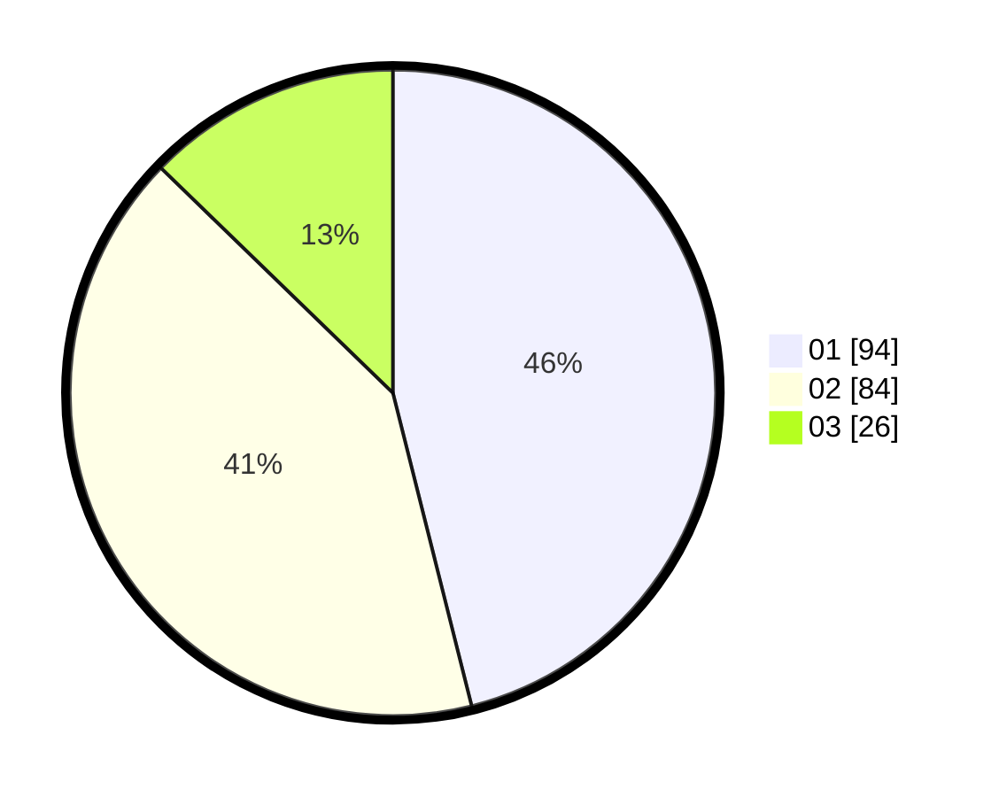

# Hasil

Hasil perolehan suara paslon dapat dilihat pada file paslon-01.txt, paslon-02.txt, dan paslon-03.txt.

Jika tidak ada, artinya data tersebut belum ada pada SIREKAP.

## Perolehan Suara

 * Paslon 01: **94**.
 * Paslon 02: **84**.
 * Paslon 03: **26**.

## Foto C Plano

https://sirekap-obj-formc.kpu.go.id/ab31/pemilu/ppwp/31/74/01/10/07/3174011007089-20240216-020340--1a4c552b-d8f0-48eb-93e9-99c596e54cb8.jpg

https://sirekap-obj-formc.kpu.go.id/ab31/pemilu/ppwp/31/74/01/10/07/3174011007089-20240214-193731--f0463375-1a3a-482f-81ff-7f39f806eff2.jpg

https://sirekap-obj-formc.kpu.go.id/ab31/pemilu/ppwp/31/74/01/10/07/3174011007089-20240214-193714--2ef6a5ac-7893-4851-8713-626140eb0e72.jpg

## DATA PEMILIH TETAP

Jumlah pemilih dalam DPT: **275**.
 * L: **143**.
 * P: **132**.

## DATA PENGGUNA HAK PILIH

Jumlah pengguna hak pilih dalam DPT: **205**.
 * L: **101**.
 * P: **104**.

Jumlah pengguna hak pilih dalam DPTb: **5**.
 * L: **2**.
 * P: **3**.

Jumlah pengguna hak pilih dalam DPK: **0**.
 * L: **0**.
 * P: **0**.

Jumlah pengguna hak pilih: **210**.
 * L: **103**.
 * P: **107**.

## JUMLAH SUARA SAH DAN TIDAK SAH

JUMLAH SELURUH SUARA SAH: **204**.

JUMLAH SUARA TIDAK SAH: **6**.

JUMLAH SELURUH SUARA SAH DAN SUARA TIDAK SAH: **210**.
