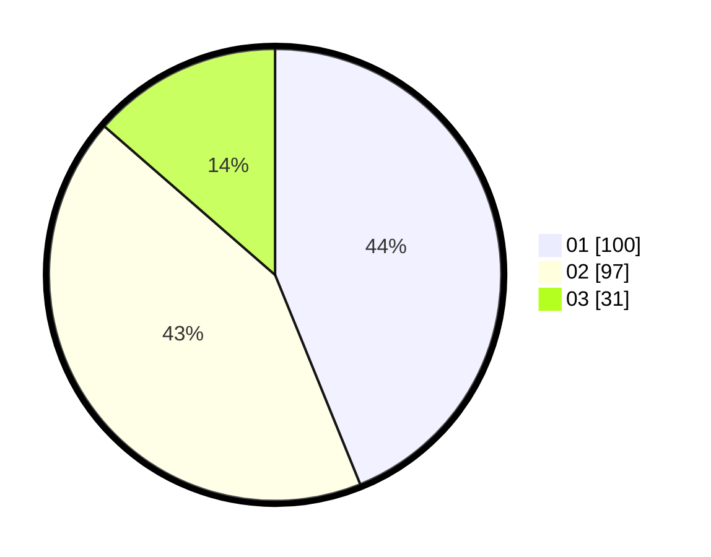

# Hasil

Hasil perolehan suara paslon dapat dilihat pada file paslon-01.txt, paslon-02.txt, dan paslon-03.txt.

Jika tidak ada, artinya data tersebut belum ada pada SIREKAP.

## Perolehan Suara

 * Paslon 01: **100**.
 * Paslon 02: **97**.
 * Paslon 03: **31**.

## Foto C Plano

https://sirekap-obj-formc.kpu.go.id/08ef/pemilu/ppwp/31/74/01/10/07/3174011007091-20240214-195316--fdba4011-e2ba-4a1b-b7a6-f5ebd96db022.jpg

https://sirekap-obj-formc.kpu.go.id/08ef/pemilu/ppwp/31/74/01/10/07/3174011007091-20240214-195423--0b5c6856-7a4b-420c-a613-79c555444af1.jpg

https://sirekap-obj-formc.kpu.go.id/08ef/pemilu/ppwp/31/74/01/10/07/3174011007091-20240214-195542--b4ce08ad-88a7-45ef-85ff-b88cfa44ce6b.jpg

## DATA PEMILIH TETAP

Jumlah pemilih dalam DPT: **296**.
 * L: **141**.
 * P: **155**.

## DATA PENGGUNA HAK PILIH

Jumlah pengguna hak pilih dalam DPT: **223**.
 * L: **108**.
 * P: **115**.

Jumlah pengguna hak pilih dalam DPTb: **4**.
 * L: **3**.
 * P: **1**.

Jumlah pengguna hak pilih dalam DPK: **2**.
 * L: **1**.
 * P: **1**.

Jumlah pengguna hak pilih: **229**.
 * L: **112**.
 * P: **117**.

## JUMLAH SUARA SAH DAN TIDAK SAH

JUMLAH SELURUH SUARA SAH: **228**.

JUMLAH SUARA TIDAK SAH: **1**.

JUMLAH SELURUH SUARA SAH DAN SUARA TIDAK SAH: **229**.
