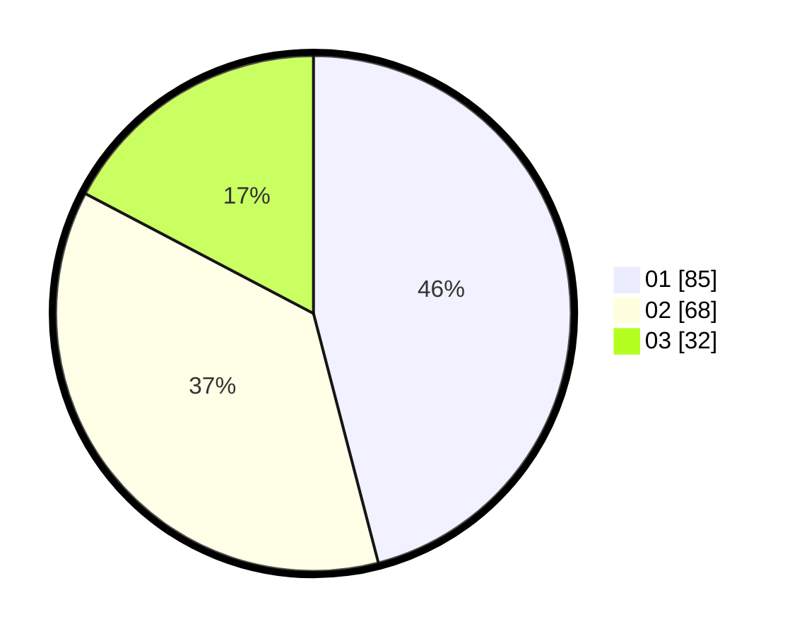

# Hasil

Hasil perolehan suara paslon dapat dilihat pada file paslon-01.txt, paslon-02.txt, dan paslon-03.txt.

Jika tidak ada, artinya data tersebut belum ada pada SIREKAP.

## Perolehan Suara

 * Paslon 01: **85**.
 * Paslon 02: **68**.
 * Paslon 03: **32**.

## Foto C Plano

https://sirekap-obj-formc.kpu.go.id/d1aa/pemilu/ppwp/31/74/01/10/07/3174011007093-20240218-081121--3fb06bf3-a9a4-493e-b1c0-9d36c69a78dc.jpg

https://sirekap-obj-formc.kpu.go.id/d1aa/pemilu/ppwp/31/74/01/10/07/3174011007093-20240216-202708--5d151e19-b97a-45b1-85ed-70ff8a45fd21.jpg

https://sirekap-obj-formc.kpu.go.id/d1aa/pemilu/ppwp/31/74/01/10/07/3174011007093-20240214-155633--f8b75763-05ad-429d-acac-e4209d5da952.jpg

## DATA PEMILIH TETAP

Jumlah pemilih dalam DPT: **240**.
 * L: **123**.
 * P: **117**.

## DATA PENGGUNA HAK PILIH

Jumlah pengguna hak pilih dalam DPT: **183**.
 * L: **93**.
 * P: **90**.

Jumlah pengguna hak pilih dalam DPTb: **3**.
 * L: **1**.
 * P: **2**.

Jumlah pengguna hak pilih dalam DPK: **1**.
 * L: **0**.
 * P: **1**.

Jumlah pengguna hak pilih: **187**.
 * L: **94**.
 * P: **93**.

## JUMLAH SUARA SAH DAN TIDAK SAH

JUMLAH SELURUH SUARA SAH: **185**.

JUMLAH SUARA TIDAK SAH: **2**.

JUMLAH SELURUH SUARA SAH DAN SUARA TIDAK SAH: **187**.
