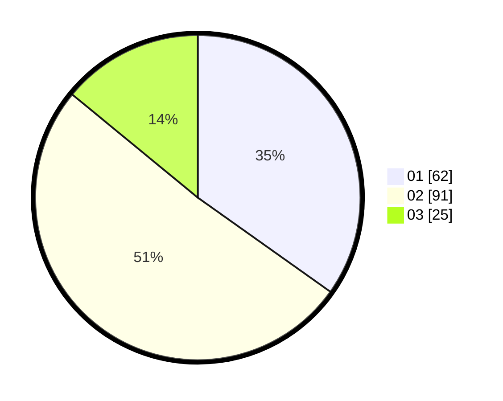

# Hasil

Hasil perolehan suara paslon dapat dilihat pada file paslon-01.txt, paslon-02.txt, dan paslon-03.txt.

Jika tidak ada, artinya data tersebut belum ada pada SIREKAP.

## Perolehan Suara

 * Paslon 01: **62**.
 * Paslon 02: **91**.
 * Paslon 03: **25**.

## Foto C Plano

https://sirekap-obj-formc.kpu.go.id/352c/pemilu/ppwp/31/74/01/10/07/3174011007096-20240214-201405--3933fb46-7240-40b6-a020-905baa87e220.jpg

https://sirekap-obj-formc.kpu.go.id/352c/pemilu/ppwp/31/74/01/10/07/3174011007096-20240214-201247--c5375173-7e97-404e-b3be-802c051bc686.jpg

https://sirekap-obj-formc.kpu.go.id/352c/pemilu/ppwp/31/74/01/10/07/3174011007096-20240214-201459--0568b283-5922-48e3-be6e-6ec653e9d48f.jpg

## DATA PEMILIH TETAP

Jumlah pemilih dalam DPT: **238**.
 * L: **121**.
 * P: **117**.

## DATA PENGGUNA HAK PILIH

Jumlah pengguna hak pilih dalam DPT: **183**.
 * L: **93**.
 * P: **90**.

Jumlah pengguna hak pilih dalam DPTb: **0**.
 * L: **0**.
 * P: **0**.

Jumlah pengguna hak pilih dalam DPK: **0**.
 * L: **0**.
 * P: **0**.

Jumlah pengguna hak pilih: **183**.
 * L: **93**.
 * P: **90**.

## JUMLAH SUARA SAH DAN TIDAK SAH

JUMLAH SELURUH SUARA SAH: **178**.

JUMLAH SUARA TIDAK SAH: **5**.

JUMLAH SELURUH SUARA SAH DAN SUARA TIDAK SAH: **183**.
