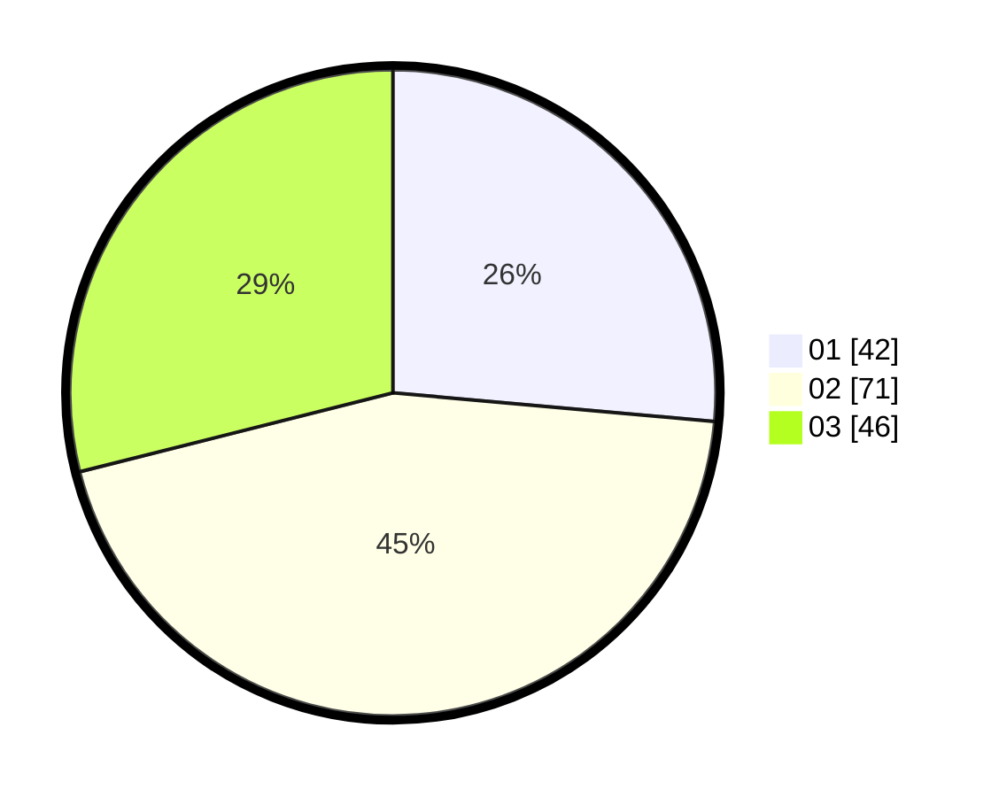

# Hasil

Hasil perolehan suara paslon dapat dilihat pada file paslon-01.txt, paslon-02.txt, dan paslon-03.txt.

Jika tidak ada, artinya data tersebut belum ada pada SIREKAP.

## Perolehan Suara

 * Paslon 01: **42**.
 * Paslon 02: **71**.
 * Paslon 03: **46**.

## Foto C Plano

https://sirekap-obj-formc.kpu.go.id/830f/pemilu/ppwp/31/74/02/10/01/3174021001012-20240215-014516--afa628bd-afa8-40db-a135-8fe57b3f9c38.jpg

https://sirekap-obj-formc.kpu.go.id/830f/pemilu/ppwp/31/74/02/10/01/3174021001012-20240215-014615--59038150-0f38-4cfd-a6f0-caae0ead5717.jpg

https://sirekap-obj-formc.kpu.go.id/830f/pemilu/ppwp/31/74/02/10/01/3174021001012-20240215-014730--28946586-61fc-42a3-b9bd-0fa26e210b67.jpg
