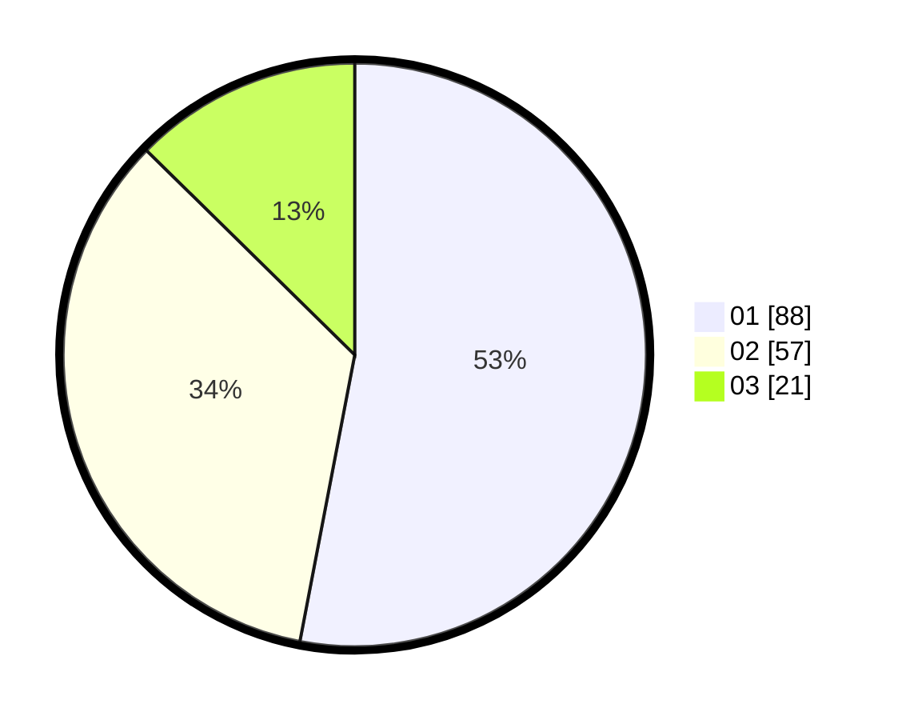

# Hasil

Hasil perolehan suara paslon dapat dilihat pada file paslon-01.txt, paslon-02.txt, dan paslon-03.txt.

Jika tidak ada, artinya data tersebut belum ada pada SIREKAP.

## Perolehan Suara

 * Paslon 01: **88**.
 * Paslon 02: **57**.
 * Paslon 03: **21**.

## Foto C Plano

https://sirekap-obj-formc.kpu.go.id/8186/pemilu/ppwp/31/74/02/10/02/3174021002001-20240214-235107--eab17f1c-3b74-4ce1-8c32-d9fd4cb45fb7.jpg

https://sirekap-obj-formc.kpu.go.id/8186/pemilu/ppwp/31/74/02/10/02/3174021002001-20240214-235351--dba1ffa1-1b26-47f0-90a9-4667308894e8.jpg

https://sirekap-obj-formc.kpu.go.id/8186/pemilu/ppwp/31/74/02/10/02/3174021002001-20240214-235651--5b3a9b58-ccd5-4081-b8af-3efe51c178a4.jpg
