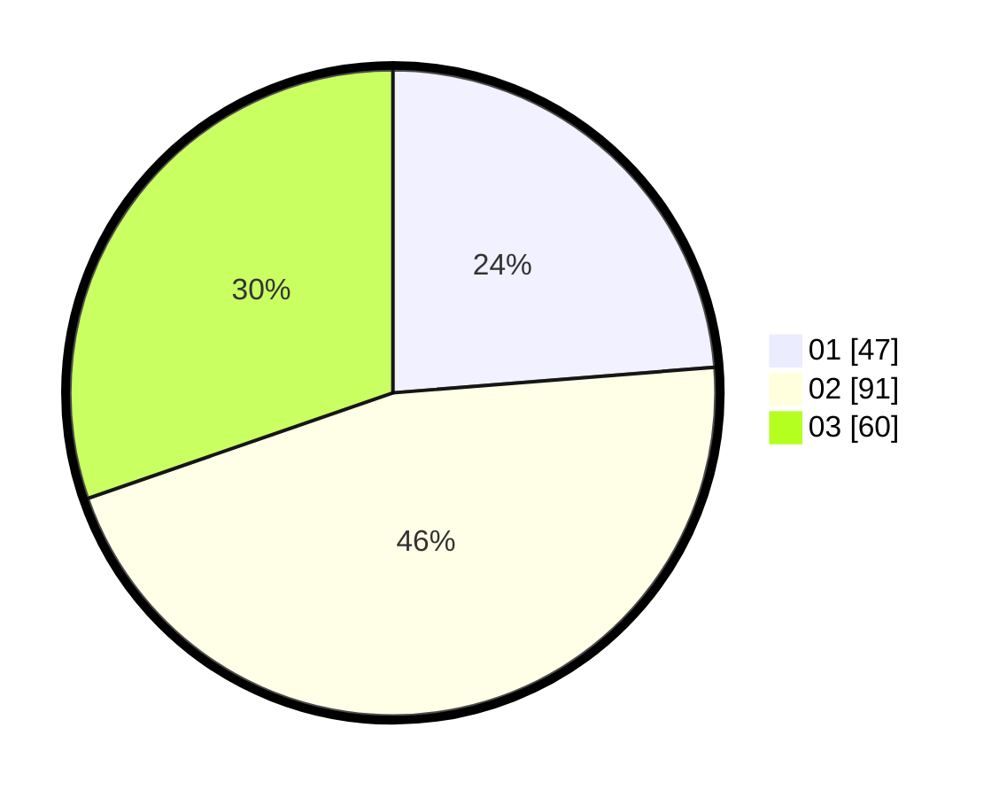

# Hasil

Hasil perolehan suara paslon dapat dilihat pada file paslon-01.txt, paslon-02.txt, dan paslon-03.txt.

Jika tidak ada, artinya data tersebut belum ada pada SIREKAP.

## Perolehan Suara

 * Paslon 01: **47**.
 * Paslon 02: **91**.
 * Paslon 03: **60**.

## Foto C Plano

https://sirekap-obj-formc.kpu.go.id/cc62/pemilu/ppwp/31/74/02/10/02/3174021002010-20240214-205729--5246a574-4a97-4ce6-acfc-ec6ea7a565e1.jpg

https://sirekap-obj-formc.kpu.go.id/cc62/pemilu/ppwp/31/74/02/10/02/3174021002010-20240214-193428--7a94e3b9-cc4c-4888-b3ae-6f8b61c53a90.jpg

https://sirekap-obj-formc.kpu.go.id/cc62/pemilu/ppwp/31/74/02/10/02/3174021002010-20240214-193437--206b5a2b-8023-4f34-9e48-b14796fa8908.jpg

## DATA PEMILIH TETAP

Jumlah pemilih dalam DPT: **282**.
 * L: **134**.
 * P: **148**.

## DATA PENGGUNA HAK PILIH

Jumlah pengguna hak pilih dalam DPT: **175**.
 * L: **83**.
 * P: **92**.

Jumlah pengguna hak pilih dalam DPTb: **24**.
 * L: **10**.
 * P: **14**.

Jumlah pengguna hak pilih dalam DPK: **3**.
 * L: **1**.
 * P: **2**.

Jumlah pengguna hak pilih: **202**.
 * L: **94**.
 * P: **108**.

## JUMLAH SUARA SAH DAN TIDAK SAH

JUMLAH SELURUH SUARA SAH: **198**.

JUMLAH SUARA TIDAK SAH: **4**.

JUMLAH SELURUH SUARA SAH DAN SUARA TIDAK SAH: **202**.
