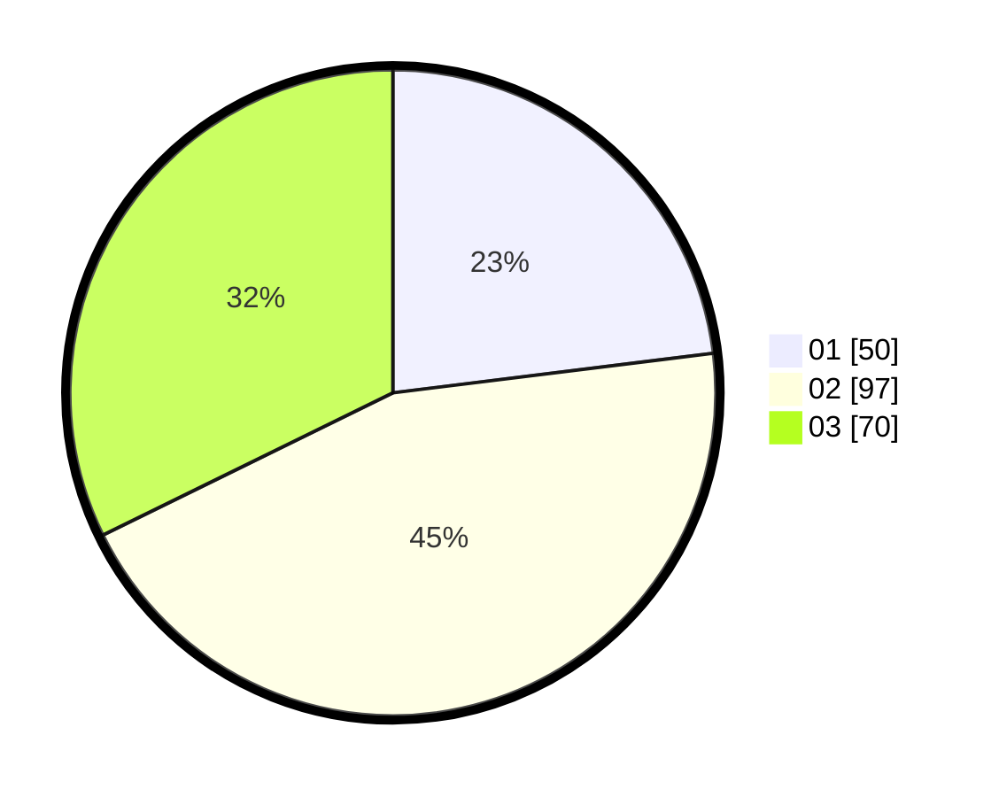

# Hasil

Hasil perolehan suara paslon dapat dilihat pada file paslon-01.txt, paslon-02.txt, dan paslon-03.txt.

Jika tidak ada, artinya data tersebut belum ada pada SIREKAP.

## Perolehan Suara

 * Paslon 01: **50**.
 * Paslon 02: **97**.
 * Paslon 03: **70**.

## Foto C Plano

https://sirekap-obj-formc.kpu.go.id/98f9/pemilu/ppwp/31/74/02/10/03/3174021003047-20240214-195336--c9613b2f-1ae7-45de-87a1-06885c986623.jpg

https://sirekap-obj-formc.kpu.go.id/98f9/pemilu/ppwp/31/74/02/10/03/3174021003047-20240214-195357--c9bdb79e-8432-4963-be1f-a5bc8b10d8f6.jpg
