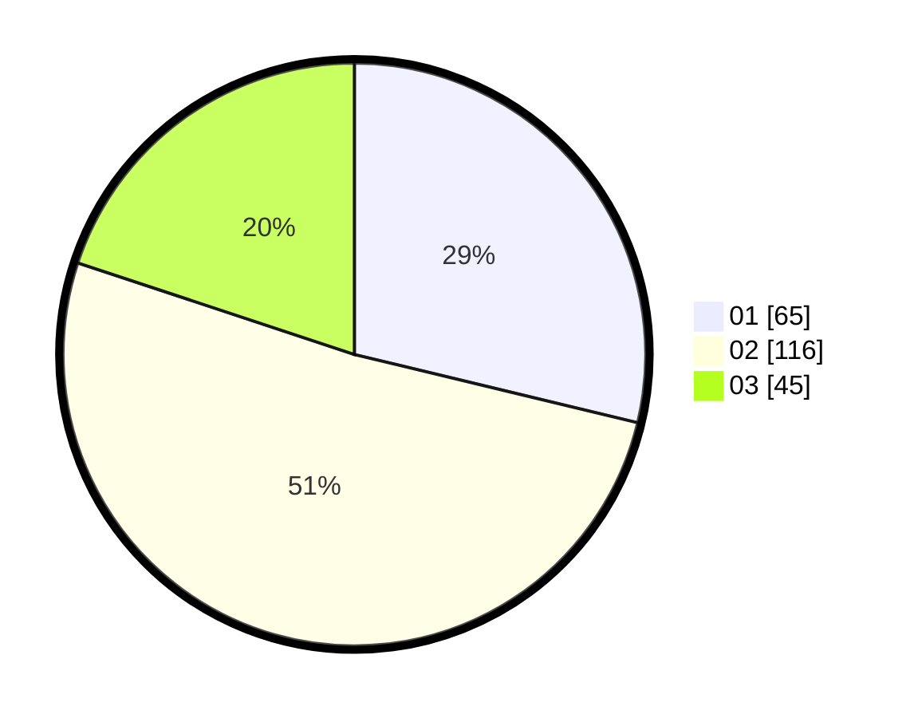

# Hasil

Hasil perolehan suara paslon dapat dilihat pada file paslon-01.txt, paslon-02.txt, dan paslon-03.txt.

Jika tidak ada, artinya data tersebut belum ada pada SIREKAP.

## Perolehan Suara

 * Paslon 01: **65**.
 * Paslon 02: **116**.
 * Paslon 03: **45**.

## Foto C Plano

https://sirekap-obj-formc.kpu.go.id/44eb/pemilu/ppwp/31/74/02/10/03/3174021003054-20240214-202203--6e07c562-1117-47c9-bbc3-face77cbc0ab.jpg

https://sirekap-obj-formc.kpu.go.id/44eb/pemilu/ppwp/31/74/02/10/03/3174021003054-20240214-202423--d23e8846-6184-4fe2-987a-9b96ce289564.jpg

https://sirekap-obj-formc.kpu.go.id/44eb/pemilu/ppwp/31/74/02/10/03/3174021003054-20240214-202536--f057d40e-2ad3-4715-b1b2-e93f640d21bf.jpg

## DATA PEMILIH TETAP

Jumlah pemilih dalam DPT: **263**.
 * L: **127**.
 * P: **136**.

## DATA PENGGUNA HAK PILIH

Jumlah pengguna hak pilih dalam DPT: **200**.
 * L: **96**.
 * P: **104**.

Jumlah pengguna hak pilih dalam DPTb: **24**.
 * L: **8**.
 * P: **16**.

Jumlah pengguna hak pilih dalam DPK: **4**.
 * L: **1**.
 * P: **3**.

Jumlah pengguna hak pilih: **228**.
 * L: **105**.
 * P: **123**.

## JUMLAH SUARA SAH DAN TIDAK SAH

JUMLAH SELURUH SUARA SAH: **226**.

JUMLAH SUARA TIDAK SAH: **2**.

JUMLAH SELURUH SUARA SAH DAN SUARA TIDAK SAH: **228**.
