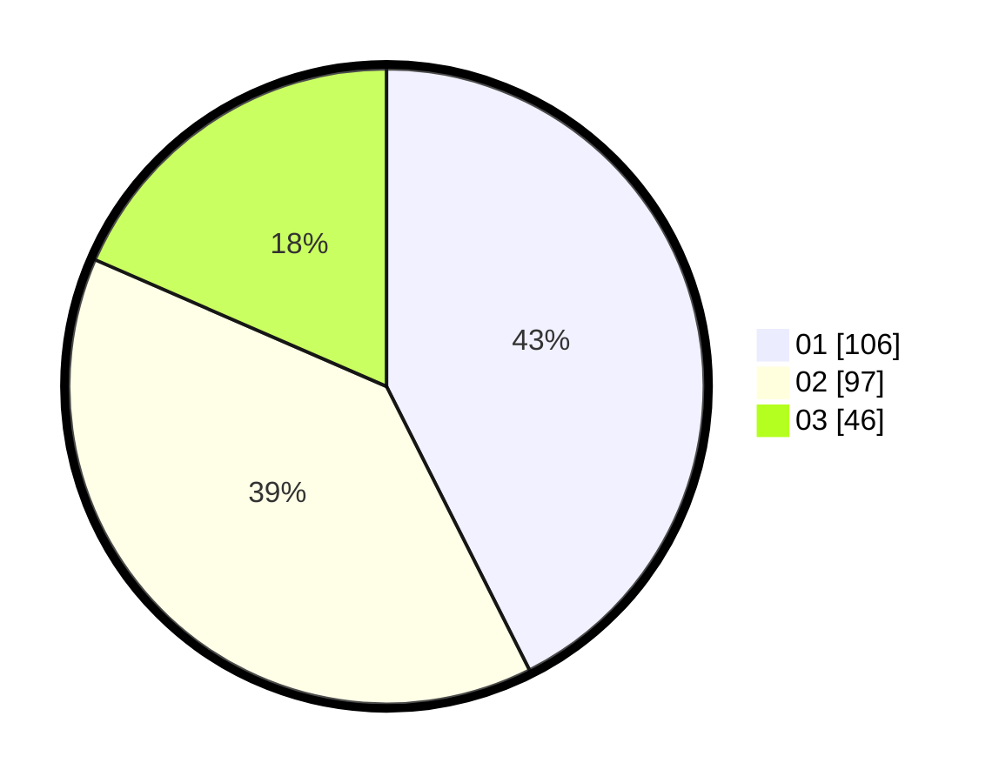

# Hasil

Hasil perolehan suara paslon dapat dilihat pada file paslon-01.txt, paslon-02.txt, dan paslon-03.txt.

Jika tidak ada, artinya data tersebut belum ada pada SIREKAP.

## Perolehan Suara

 * Paslon 01: **106**.
 * Paslon 02: **97**.
 * Paslon 03: **46**.

## Foto C Plano

https://sirekap-obj-formc.kpu.go.id/89b9/pemilu/ppwp/31/74/02/10/04/3174021004010-20240214-204214--5754da54-7133-455c-b4bd-a2e52830fea8.jpg

https://sirekap-obj-formc.kpu.go.id/89b9/pemilu/ppwp/31/74/02/10/04/3174021004010-20240214-204510--80b6636d-00d6-4703-8332-c2581ed94752.jpg

https://sirekap-obj-formc.kpu.go.id/89b9/pemilu/ppwp/31/74/02/10/04/3174021004010-20240214-200252--abf3c7da-b87b-4607-8f96-c6238ef90f69.jpg

## DATA PEMILIH TETAP

Jumlah pemilih dalam DPT: **293**.
 * L: **138**.
 * P: **155**.

## DATA PENGGUNA HAK PILIH

Jumlah pengguna hak pilih dalam DPT: **234**.
 * L: **111**.
 * P: **123**.

Jumlah pengguna hak pilih dalam DPTb: **17**.
 * L: **8**.
 * P: **9**.

Jumlah pengguna hak pilih dalam DPK: **1**.
 * L: **1**.
 * P: **0**.

Jumlah pengguna hak pilih: **252**.
 * L: **120**.
 * P: **132**.

## JUMLAH SUARA SAH DAN TIDAK SAH

JUMLAH SELURUH SUARA SAH: **249**.

JUMLAH SUARA TIDAK SAH: **3**.

JUMLAH SELURUH SUARA SAH DAN SUARA TIDAK SAH: **252**.
