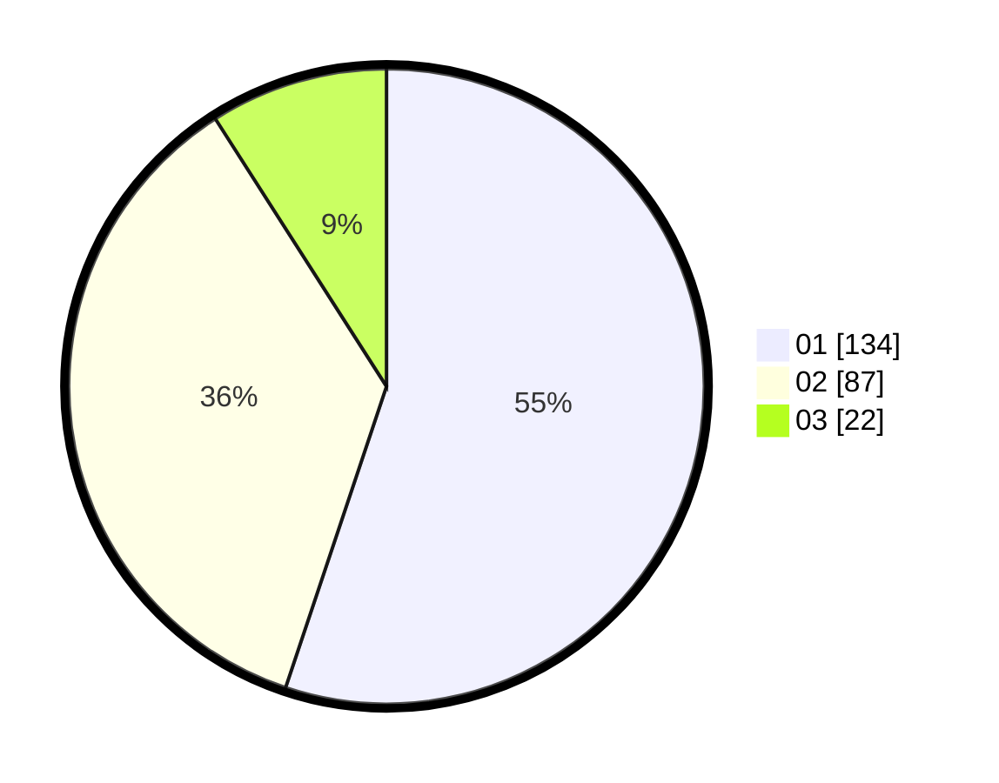

# Hasil

Hasil perolehan suara paslon dapat dilihat pada file paslon-01.txt, paslon-02.txt, dan paslon-03.txt.

Jika tidak ada, artinya data tersebut belum ada pada SIREKAP.

## Perolehan Suara

 * Paslon 01: **134**.
 * Paslon 02: **87**.
 * Paslon 03: **22**.

## Foto C Plano

https://sirekap-obj-formc.kpu.go.id/5a83/pemilu/ppwp/31/74/02/10/05/3174021005017-20240215-031234--a00316a1-1e4c-425d-80dd-5080d5f9e542.jpg

https://sirekap-obj-formc.kpu.go.id/5a83/pemilu/ppwp/31/74/02/10/05/3174021005017-20240214-190003--2a4080ad-e453-41f6-b0d4-f2fa6263ab58.jpg

https://sirekap-obj-formc.kpu.go.id/5a83/pemilu/ppwp/31/74/02/10/05/3174021005017-20240214-190018--422fe678-b3f8-4054-9395-77bddaa6eaaf.jpg

## DATA PEMILIH TETAP

Jumlah pemilih dalam DPT: **291**.
 * L: **141**.
 * P: **150**.

## DATA PENGGUNA HAK PILIH

Jumlah pengguna hak pilih dalam DPT: **237**.
 * L: **117**.
 * P: **120**.

Jumlah pengguna hak pilih dalam DPTb: **6**.
 * L: **2**.
 * P: **4**.

Jumlah pengguna hak pilih dalam DPK: **0**.
 * L: **0**.
 * P: **0**.

Jumlah pengguna hak pilih: **243**.
 * L: **119**.
 * P: **124**.

## JUMLAH SUARA SAH DAN TIDAK SAH

JUMLAH SELURUH SUARA SAH: **243**.

JUMLAH SUARA TIDAK SAH: **0**.

JUMLAH SELURUH SUARA SAH DAN SUARA TIDAK SAH: **243**.
