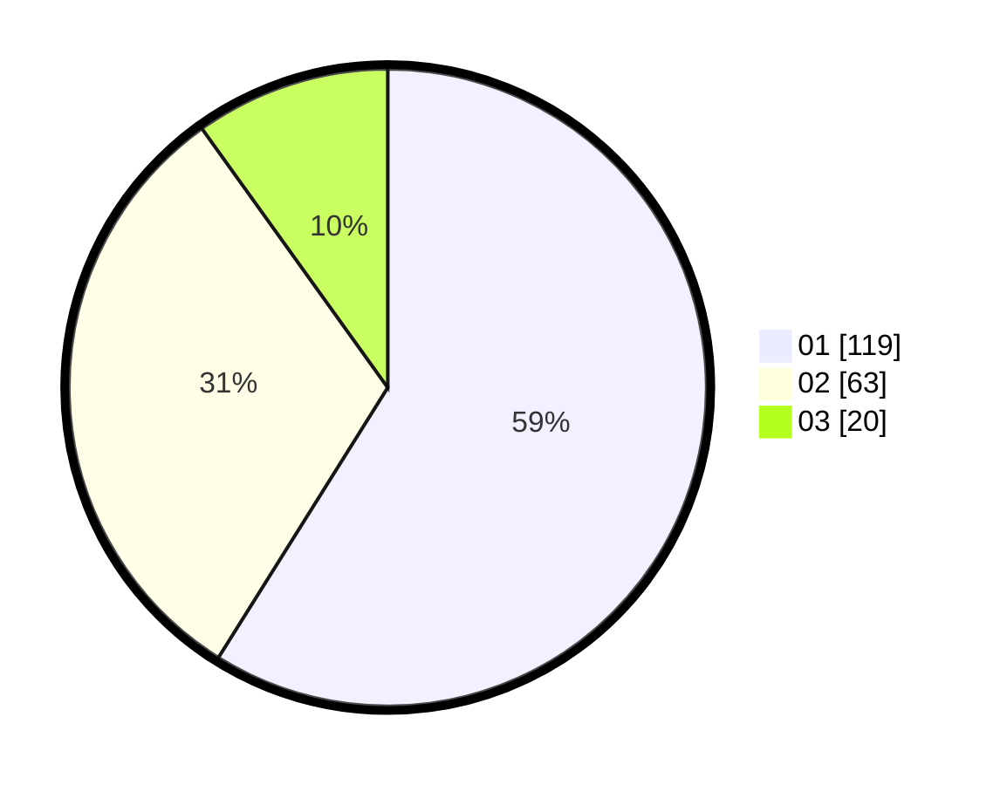

# Hasil

Hasil perolehan suara paslon dapat dilihat pada file paslon-01.txt, paslon-02.txt, dan paslon-03.txt.

Jika tidak ada, artinya data tersebut belum ada pada SIREKAP.

## Perolehan Suara

 * Paslon 01: **119**.
 * Paslon 02: **63**.
 * Paslon 03: **20**.

## Foto C Plano

https://sirekap-obj-formc.kpu.go.id/4763/pemilu/ppwp/31/74/02/10/05/3174021005018-20240214-192405--2e2e9be3-8415-4d6f-a1ac-9f79360244ad.jpg

https://sirekap-obj-formc.kpu.go.id/4763/pemilu/ppwp/31/74/02/10/05/3174021005018-20240215-055132--d5c4b691-e5d9-4dba-aae4-c4186f025fe0.jpg

https://sirekap-obj-formc.kpu.go.id/4763/pemilu/ppwp/31/74/02/10/05/3174021005018-20240214-202531--4927d930-c779-401b-950d-88388d42ce54.jpg

## DATA PEMILIH TETAP

Jumlah pemilih dalam DPT: **240**.
 * L: **119**.
 * P: **121**.

## DATA PENGGUNA HAK PILIH

Jumlah pengguna hak pilih dalam DPT: **198**.
 * L: **94**.
 * P: **104**.

Jumlah pengguna hak pilih dalam DPTb: **3**.
 * L: **0**.
 * P: **3**.

Jumlah pengguna hak pilih dalam DPK: **3**.
 * L: **0**.
 * P: **3**.

Jumlah pengguna hak pilih: **204**.
 * L: **94**.
 * P: **110**.

## JUMLAH SUARA SAH DAN TIDAK SAH

JUMLAH SELURUH SUARA SAH: **202**.

JUMLAH SUARA TIDAK SAH: **2**.

JUMLAH SELURUH SUARA SAH DAN SUARA TIDAK SAH: **204**.
