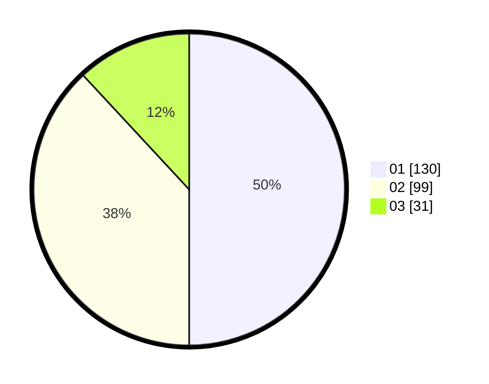

# Hasil

Hasil perolehan suara paslon dapat dilihat pada file paslon-01.txt, paslon-02.txt, dan paslon-03.txt.

Jika tidak ada, artinya data tersebut belum ada pada SIREKAP.

## Perolehan Suara

 * Paslon 01: **130**.
 * Paslon 02: **99**.
 * Paslon 03: **31**.

## Foto C Plano

https://sirekap-obj-formc.kpu.go.id/f696/pemilu/ppwp/31/74/02/10/05/3174021005023-20240215-011801--5178b56a-4227-4704-b610-a921e268f908.jpg

https://sirekap-obj-formc.kpu.go.id/f696/pemilu/ppwp/31/74/02/10/05/3174021005023-20240215-011850--834e6298-dc0d-42f6-9116-62467b46f204.jpg

https://sirekap-obj-formc.kpu.go.id/f696/pemilu/ppwp/31/74/02/10/05/3174021005023-20240215-011934--97312fc2-7fd5-4cae-ab7a-1896d7c5f1cf.jpg

## DATA PEMILIH TETAP

Jumlah pemilih dalam DPT: **292**.
 * L: **153**.
 * P: **139**.

## DATA PENGGUNA HAK PILIH

Jumlah pengguna hak pilih dalam DPT: **249**.
 * L: **125**.
 * P: **124**.

Jumlah pengguna hak pilih dalam DPTb: **12**.
 * L: **5**.
 * P: **7**.

Jumlah pengguna hak pilih dalam DPK: **1**.
 * L: **0**.
 * P: **1**.

Jumlah pengguna hak pilih: **262**.
 * L: **130**.
 * P: **132**.

## JUMLAH SUARA SAH DAN TIDAK SAH

JUMLAH SELURUH SUARA SAH: **260**.

JUMLAH SUARA TIDAK SAH: **2**.

JUMLAH SELURUH SUARA SAH DAN SUARA TIDAK SAH: **262**.
