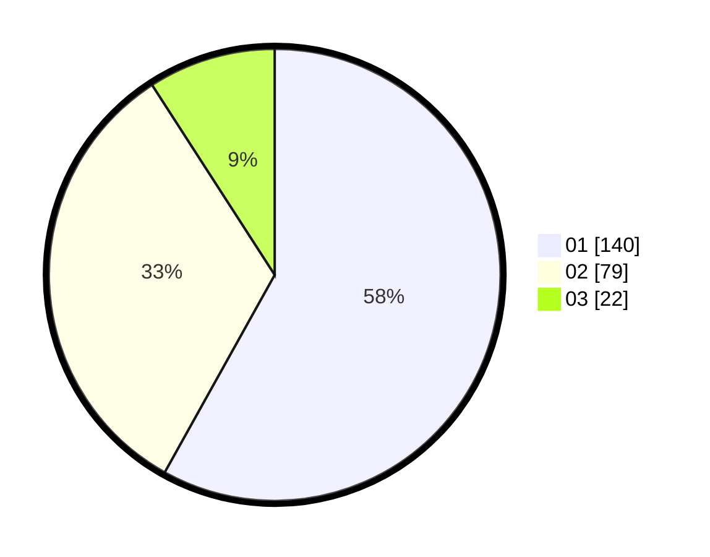

# Hasil

Hasil perolehan suara paslon dapat dilihat pada file paslon-01.txt, paslon-02.txt, dan paslon-03.txt.

Jika tidak ada, artinya data tersebut belum ada pada SIREKAP.

## Perolehan Suara

 * Paslon 01: **140**.
 * Paslon 02: **79**.
 * Paslon 03: **22**.

## Foto C Plano

https://sirekap-obj-formc.kpu.go.id/240b/pemilu/ppwp/31/74/02/10/05/3174021005029-20240214-230928--0e133bae-d8bb-478a-8f4b-5a780dbc517a.jpg

https://sirekap-obj-formc.kpu.go.id/240b/pemilu/ppwp/31/74/02/10/05/3174021005029-20240214-231020--471d236a-cea3-4dca-a135-955cc6dedef1.jpg

https://sirekap-obj-formc.kpu.go.id/240b/pemilu/ppwp/31/74/02/10/05/3174021005029-20240214-231123--3ac480ce-4d5e-44e9-936f-7aeee4dd8c08.jpg

## DATA PEMILIH TETAP

Jumlah pemilih dalam DPT: **281**.
 * L: **144**.
 * P: **137**.

## DATA PENGGUNA HAK PILIH

Jumlah pengguna hak pilih dalam DPT: **236**.
 * L: **120**.
 * P: **116**.

Jumlah pengguna hak pilih dalam DPTb: **7**.
 * L: **4**.
 * P: **3**.

Jumlah pengguna hak pilih dalam DPK: **0**.
 * L: **0**.
 * P: **0**.

Jumlah pengguna hak pilih: **243**.
 * L: **124**.
 * P: **119**.

## JUMLAH SUARA SAH DAN TIDAK SAH

JUMLAH SELURUH SUARA SAH: **241**.

JUMLAH SUARA TIDAK SAH: **2**.

JUMLAH SELURUH SUARA SAH DAN SUARA TIDAK SAH: **243**.
